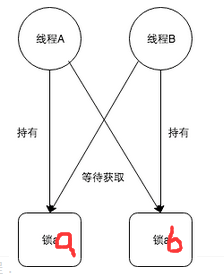

# 死锁

## 一、产生死锁的原因
   线程A占有不可抢占的资源a还要获取其他不可抢占的资源b && 线程B占有不可抢占的资源b还有要获取其他不可抢占的资源a。

        
   
## 二、死锁产生的四个必要条件
   1.互斥：非共享资资源
   
   2.占有并等待：拥有了还想要
   
   3.非抢占：资源必须是自愿释放
   
   4.循环等待：线程之间形成环形的资源等待关系
    
## 三、如何解决死锁？
   1.尽量不要让程序出现多个锁层叠的关系
   
   2.超时放弃：Lock接口提供了boolean tryLock(long time, TimeUnit unit) throws InterruptedException方法
   
   3.以确定的顺序获得锁
    
## 四、如何找到死锁的两个线程（死锁检测）？
   cmd -> jps找到产生死锁的线程相应的进程号 -> jstack 进程号 -> 就会显示found n deadlock
    