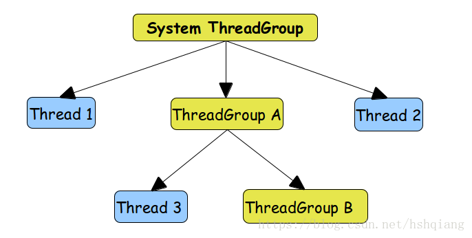

# ThreadGroup介绍

## 一、ThreadGroup结构

## 二、ThreadGroup官方API说明
1.介绍
    
    一个ThreadGroup代表一组线程，此外一个ThreadGroup也可以包含其他的ThreadGroup。ThreadGroup是一个树状结构，每次
    创建新的ThreadGroup就会加到该树状结构中。新加入的ThreadGroup允许访问他所在的ThreadGroup，但是不能访问....的信息。
2.作用
    
    为线程服务，用户通过使用线程组的概念批量管理线程，如批量停止或挂起等。
       
## 三、如何创建ThreadGroup
1.两种创建方式

    ThreadGroup(String name)：根据线程组名称创建线程组，其父线程组为main线程组
    ThreadGroup(ThreadGroup parent, String name)：根据线程组名称创建线程组，其父线程组为指定的parent线程组
2.代码    
~~~ java
public class ThreadGroupCreate {
    public static void main(String[] args) {
        ThreadGroup tg1 = new ThreadGroup("TG1"); // 根据线程组名称创建线程组，其父线程组为main线程组
        ThreadGroup tg2 = new ThreadGroup(tg1, "TG2"); // 根据线程组名称创建线程组，其父线程组为指定的parent线程组

        System.out.println("tg1 name: " + tg1.getName() + "\n" + "tg1 parent: " + tg1.getParent().getName());
        System.out.println("tg2 name: " + tg2.getName() + "\n" + "tg2 parent: " + tg2.getParent().getName());
    }
}
~~~
3.Console输出
~~~ java
tg1 name: TG1
tg1 parent: main
tg2 name: TG2
tg2 parent: TG1
~~~

## 三、ThreadGroup的用法
查看线程组信息、终止线程组中的所有线程