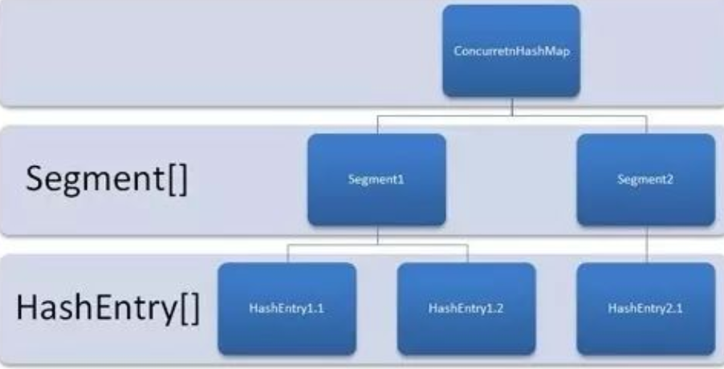

# 额外重要知识点

## 一、锁
   锁：锁是用来控制多个线程访问共享资源的方式。
   
   锁分类：排他锁、非排他锁（读写锁中的读）
   
## 二、ConcurrentHashMap的实现原理及使用
   1.HashMap、HashTable、ConcurrentHashMap区别
   
   （1）HashMap：效率高、线程不安全（put、get等操作）
  
   （2）HashTable：效率低（所有访问HashTable的线程都必须竞争同一把锁）、线程安全
   
   （3）ConcurrentHashMap：效率高、线程安全
   
   2.ConcurrentHashMap的实现原理
   
   （1）ConcurrentHashMap的**锁分段技术**
   
   HashTable效率低的原因是所有访问HashTable的线程都必须竞争同一把锁。而ConcurrentHashMap容器中存在多个锁，其中每一把锁对应一部分数据，当多线程访问ConcurrentHashMap中不同数据段的数据时，线程就不会存在锁竞争，从而有效提高并发效率。
   
   即，首先将数据分成一段一段的存储，然后给每一段数据配一把锁，当一个线程占用锁访问其中一个数据段的时候，其他的数据段也能被访问。
   
   （2）ConcurrentHashMap的结构
   
   Segment + HashEntry + 哈希算法
   
   Segment：（类似HashMap）数组 + 链表，包含着Segment数组
   
   HashEntry：存储键值对数据

   （3）定位Segment
    在插入和获取ConcurrentHashMap中的元素时，必须先通过**散列算法**定位到Segment。
    
   （4）put、get、size操作
    
   get：先经过一次散列，然后使用这个散列值再通过散列运算定位到Segment，再通过散列算法定位到元素；
   
   put：也是通过两次散列运算定位插入的位置。
    
   
## 三、线程池
   1.线程池工作原理
   
   （1）工作队列：存放任务；
   
   （2）工作者线程：不断的从工作队列上取出工作并执行；当工作队列为空时，所有的工作者线程均等待在工作队列上，当有客户提交了一个任务之后会通知任意一个工作者线程。
                    随着更多的工作任务，越来越多的工作者线程会被唤醒；
      
   （3）客户端线程：将任务放入工作队列后便返回；
   
   2.创建线程池
   
   使用ThreadPoolExecutor创建一个线程池。
   
   创建一个线程池时需要输入几个参数，如下：**线程池的基本大小、任务队列、线程池最大数量、创建线程的工厂、饱和策略**
   
   3.向线程池提交任务
   
   execute()、submit()
   
   4.关闭线程池
   
   shutdown()或shutdownNow()
   
   原理：遍历线程池中的工作线程，然后逐个调用线程的interrupt方法来中断线程，所以无法响应中断的任务可能永远无法终止。
   
## 五、生产者、消费者模式   
   下篇.chapter02  
      
## 四、创建线程的四种方式
   1.继承Thread类
   
   （1）创建一个类继承Thread类，重写run()方法，将所要完成的任务代码写进run()方法中；
   
   （2）创建该类的对象；
   
   （3）调用该对象的start()方法，该start()方法表示先开启线程，然后调用run()方法；
   
   2.实现Runnable接口
   
   （1）创建一个类并实现Runnable接口
   
   （2）重写run()方法，将所要完成的任务代码写进run()方法中
   
   （3）创建实现Runnable接口的类的对象，将该对象当做Thread类的构造方法中的参数传进去
   
   （4）使用Thread类的构造方法创建一个对象，并调用start()方法即可运行该线程
   
   3.实现Callable接口
   
   （1）创建一个类并实现Callable接口
   
   （2）重写call()方法，将所要完成的任务的代码写进call()方法中，需要注意的是call()方法有返回值，并且可以抛出异常
   
   （3）如果想要获取运行该线程后的返回值，需要创建Future接口的实现类的对象，即FutureTask类的对象，调用该对象的get()方法可获取call()方法的返回值
   
   （4）使用Thread类的有参构造器创建对象，将FutureTask类的对象当做参数传进去，然后调用start()方法开启并运行该线程。
   
   4.使用线程池创建
   
   （1）使用Executors类中的newFixedThreadPool(int num)方法创建一个线程数量为num的线程池
   
   （2）调用线程池中的execute()方法执行由实现Runnable接口创建的线程；调用submit()方法执行由实现Callable接口创建的线程
   
   （3）调用线程池中的shutdown()方法关闭线程池
   
~~~ java
public class Thread4 {
     
    public static void main(String[] args) throws Exception {
         
        Thread.currentThread().setName("主线程");
        System.out.println(Thread.currentThread().getName()+":"+"输出的结果");
        //通过线程池工厂创建线程数量为2的线程池
        ExecutorService service = Executors.newFixedThreadPool(2);
        //执行线程,execute()适用于实现Runnable接口创建的线程
        service.execute(new ThreadDemo4());
        service.execute(new ThreadDemo6());
        service.execute(new ThreadDemo7());
        //submit()适用于实现Callable接口创建的线程
        Future<String> task = service.submit(new ThreadDemo5());
        //获取call()方法的返回值
        String result = task.get();
        System.out.println(result);
        //关闭线程池
        service.shutdown();
    }
}
//实现Runnable接口
class ThreadDemo4 implements Runnable{
     
    @Override
    public void run() {
        try {
            Thread.sleep(1000);
        } catch (InterruptedException e) {
            e.printStackTrace();
        }
        System.out.println(Thread.currentThread().getName()+":"+"输出的结果");
    }
     
}
//实现Callable接口
class ThreadDemo5 implements Callable<String>{
 
    @Override
    public String call() throws Exception {
        try {
            Thread.sleep(1000);
        } catch (InterruptedException e) {
            e.printStackTrace();
        }
        System.out.println(Thread.currentThread().getName()+":"+"输出的结果");
        return Thread.currentThread().getName()+":"+"返回的结果";
    }
 
}
//实现Runnable接口
class ThreadDemo6 implements Runnable{
     
    @Override
    public void run() {
        try {
            Thread.sleep(1000);
        } catch (InterruptedException e) {
            e.printStackTrace();
        }
        System.out.println(Thread.currentThread().getName()+":"+"输出的结果");
    }
     
}
//实现Runnable接口
class ThreadDemo7 implements Runnable{
     
    @Override
    public void run() {
        try {
            Thread.sleep(1000);
        } catch (InterruptedException e) {
            e.printStackTrace();
        }
        System.out.println(Thread.currentThread().getName()+":"+"输出的结果");
    }
     
}
~~~