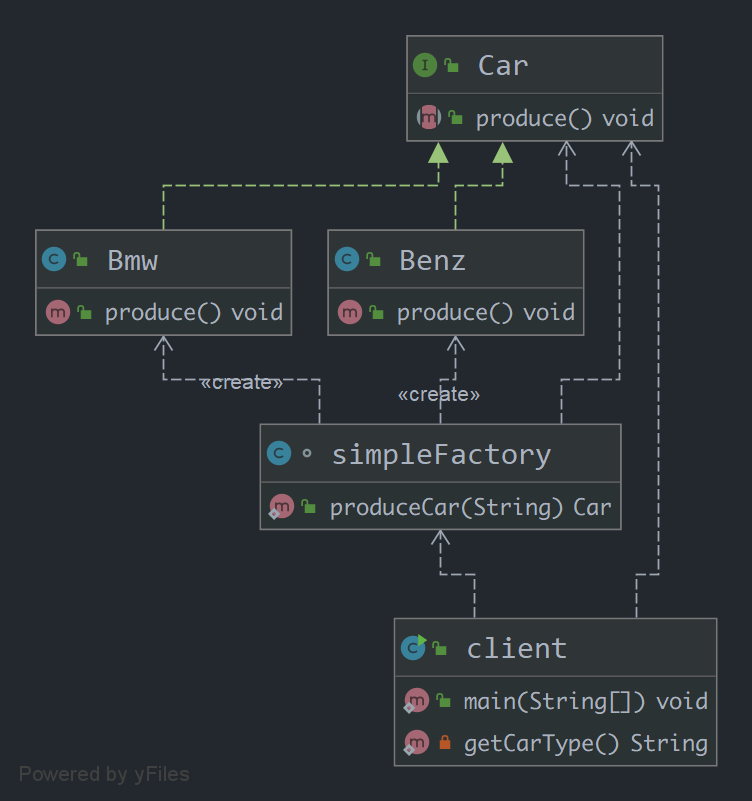

## 1.简单工厂模式
    简单工厂模式又称静态工厂方法模式。从命名上就可以看出这个模式一定很简单。它存在的目的很简单：定义一个用于创建对象的接口。 
## 2.简单工厂模式的组成： 
    1)工厂类角色(simpleFactory.class)：这是本模式的核心，含有一定的商业逻辑和判断逻辑。在java中它往往由一个具体类实现。 
    2)抽象产品角色(Car.Interface)：它一般是具体产品继承的父类或者实现的接口。在java中由接口或者抽象类来实现。 
    3)具体产品角色(Benz.class和Bmw.class)：工厂类所创建的对象就是此角色的实例。在java中由一个具体类实现。 
## 3.简单工厂模式的类图

   