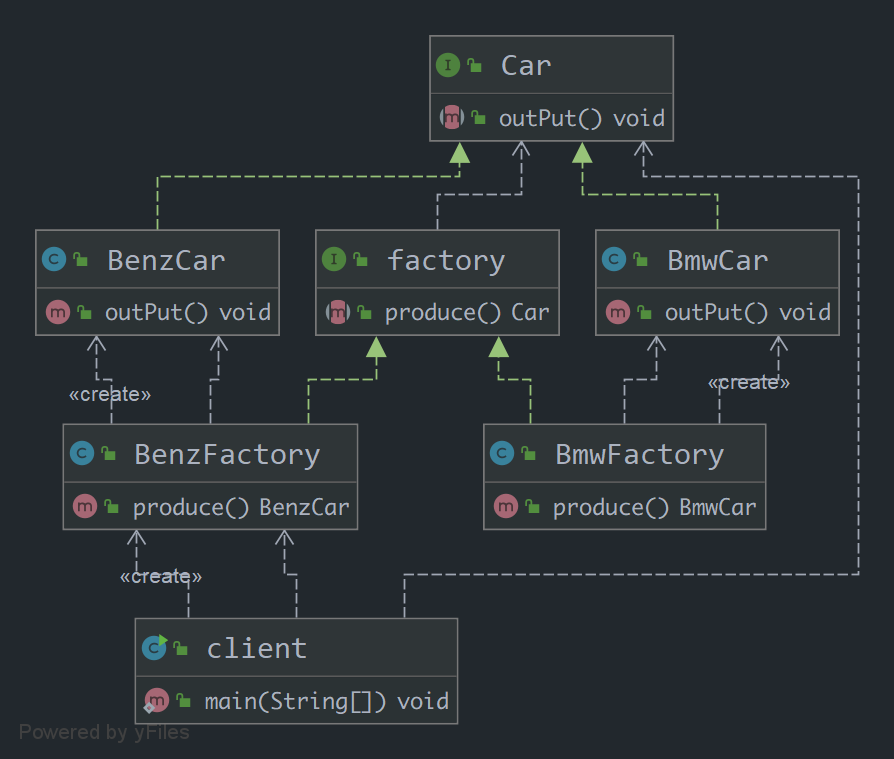

## 1. 工厂方法模式
    工厂方法模式去掉了简单工厂模式中工厂方法的静态属性，使得它可以被子类继承。这样在简单工厂模式里集中在工厂方法上的压力可以由工厂方法模式里不同的工厂子类来分担。 
***
## 2. 工厂方法模式的组成
    1) 抽象工厂角色： 这是工厂方法模式的核心，它与应用程序无关。是具体工厂角色必须实现的接口或者必须继承的父类。在 java 中它由抽象类或者接口来实现。 
    2) 具体工厂角色：它含有和具体业务逻辑有关的代码。由应用程序调用以创建对应的具体产品的对象。 
    3) 抽象产品角色：它是具体产品继承的父类或者是实现的接口。在 java 中一般有抽象类或者接口来实现。 
    4) 具体产品角色：具体工厂角色所创建的对象就是此角色的实例。在 java 中由具体的类来实现。 
***
## 3. 工厂方法模式案例的类图
   
***
## 4. 工厂方法模式的优缺点
    （1）优点
        工厂方法模式是为了克服简单工厂模式的缺点（主要是为了满足OCP：开闭原则）而设计出来的。
    （2）缺点
        每增加一个产品，相应的也要增加一个子工厂，会加大了额外的开发量。
        
        在简单工厂模式中，新产品的加入要修改工厂角色中的判断语句；而在工厂方法模式中，要么将判断逻辑留在抽象工厂角色中。
        要么在客户程序中将具体工厂角色写死（就象上面的例子一样）。而且产品对象创建条件的改变必然会引起工厂角色的修改。
        面对这种情况，Java 的反射机制与配置文件的巧妙结合突破了限制。这在 Spring 中完美的体现了出来。 