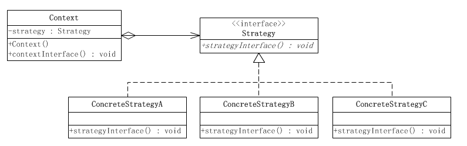

## 1. 策略模式
    （1）策略模式（Strategy）属于对象行为型设计模式，主要是定义一系列的算法，把这些算法一个个封装成拥有共同接口的单独的
        类，并且使它们之间可以互换。
    （2）策略模式使这些算法在客户端调用它们的时候能够互不影响地变化。这里的算法不要狭义的理解为数据结构中算法，可以理解
        为不同的业务处理方法。 
## 2. 策略模式的优点
    （1）将算法的使用和算法本身分离，即将变化的具体算法封装了起来，降低了代码的耦合度，系统业务策略的更变仅需少量修改。 
    （2）算法被提取出来，这样可以使算法得到重用，这种情况还可以考虑使用享元模式来共享算法对象，来减少系统开销。
## 3. 策略模式的结构
   
   
    （1）环境角色(Context)角色：持有一个Strategy的引用。
    （2）抽象策略角色(Strategy)角色：这是一个抽象角色，通常由一个接口或抽象类实现。此角色给出所有的具体策略类所需的接口。
    （3）具体策略角色(ConcreteStrategy)角色：包装了相关的算法或行为。
## 4. 案例
    假设现在要设计一个贩卖各类书籍的电子商务网站的购物车系统。
    一个最简单的情况就是把所有货品的单价乘上数量，但是实际情况肯定比这要复杂。
    比如，本网站可能对所有的高级会员提供每本20%的促销折扣；对中级会员提供每本10%的促销折扣；对初级会员没有折扣。
    
    根据描述，折扣是根据以下的几个算法中的一个进行的：
    算法一：对初级会员没有折扣。
    算法二：对中级会员提供10%的促销折扣。
    算法三：对高级会员提供20%的促销折扣。

## 5. 案例类图
   
## 6. 认识策略模式
    （1）策略模式的重心
        策略模式的重心不是如何实现算法，而是如何组织、调用这些算法，从而让程序结构更灵活，具有更好的维护性和扩展性。
    （2）算法的平等性
        策略模式一个很大的特点就是各个策略算法的平等性。对于一系列具体的策略算法，大家的地位是完全一样的，正因为这个平等性，才能实现算法之间可以相互替换。
        所有的策略算法在实现上也是相互独立的，相互之间是没有依赖的。
        所以可以这样描述这一系列策略算法：策略模式是相同行为的不同实现。、
    （3）运行时策略的唯一性
        运行期间，策略模式在每一个时刻只能使用一个具体的策略实现对象，虽然可以动态地在不同的策略实现中切换，但是同时只能使用一个。
## 7. 策略模式的优缺点
    （1）优点
        1.策略模式提供了管理相关的算法族的办法。策略类的等级结构定义了一个算法或行为族。恰当使用继承可以把公共的代码移到父类里面，从而避免代码重复。
        2.使用策略模式可以避免使用多重条件(if-else)语句。
    （2）缺点
        1.客户端必须知道所有的策略类，并自行决定使用哪一个策略类。这就意味着客户端必须理解这些算法的区别，以便适时选择恰当的算法类。换言之，策略模式只适用于客户端知道算法或行为的情况。
          没有遵循开闭原则。
        2.由于策略模式把每个具体的策略实现都单独封装成为类，如果备选的策略很多的话，那么对象的数目就会很可观。