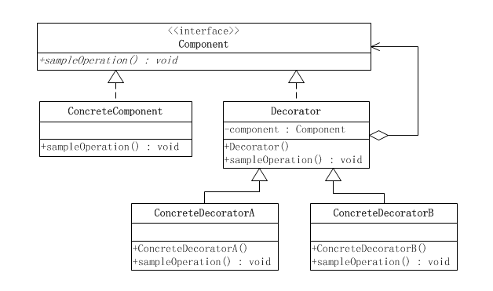
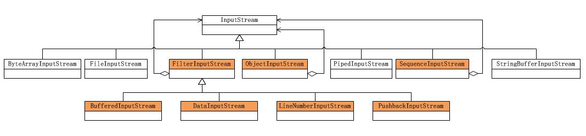

## 一、装饰模式
    在阎宏博士的《JAVA与模式》一书中开头是这样描述装饰（Decorator）模式的：
    　　装饰模式又名包装(Wrapper)模式。装饰模式以对客户端透明的方式扩展对象的功能，是继承关系的一个替代方案。
    装饰模式有透明和半透明两种，这两种的区别就在于装饰角色的接口与抽象构件角色的接口是否完全一致。透明的装饰模式也就是理想的装饰模式，
        要求具体构件角色、装饰角色的接口与抽象构件角色的接口完全一致。
***
## 二、装饰模式的结构
    装饰模式以对客户透明的方式动态地给一个对象附加上更多的责任。
    换言之，客户端并不会觉得对象在装饰前和装饰后有什么不同。
    装饰模式可以在不使用创造更多子类的情况下，将对象的功能加以扩展。
   
## 二、设计原则
    要使用装饰者模式，需要满足以下设计原则：
    1、多用组合，少用继承
    2、开放-关闭原则：类应该对拓展开放，对修改关闭
***
## 三、抽象构件角色
    1) 抽象构件角色（Component）：是基类。如：人。通常是一个抽象类或者一个接口，定义了属性或者方法，方法的实现可以由子类实现或者自己实现。
        通常不会直接使用该类，而是通过继承该类来实现特定的功能，它约束了整个继承树的行为。比如说，如果Component代表人，即使通过装饰也不会
        使人变成别的动物。 
    2) 被装饰者角色(Concrete Component)：是Component的子类。如：青少年。实现了相应的方法，它充当了“被装饰者”的角色。 
    3) 装饰者角色(Decorator)：也是Component的子类。如：衣服。它是装饰者共同实现的抽象类（也可以是接口）。比如说，Decorator代表衣服这一类
        装饰者，那么它的子类应该是T恤、裙子这样的具体的装饰者。
    4) 具体装饰角色(Concrete Decorator)：是Decorator的子类。如：衬衫。是具体的装饰者，由于它同时也是Component的子类，因此它能方便地拓展
        Component的状态（比如添加新的方法）。每个装饰者都应该有一个实例变量用以保存某个Component的引用，这也是利用了组合的特性。在持有
        Component的引用后，由于其自身也是Component的子类，那么，相当于ConcreteDecorator包裹了Component，不但有Component的特性，同时自
        身也可以有别的特性，也就是所谓的装饰。
***
## 四、案例
    你有一家服装店，卖各式各样的衣服，现在需要用一个系统来记录客户所要购买的衣服的总价，以便方便地结算。那么在这个例子里面，我们可以用装饰者模
    式，把客户当做被装饰者，衣服是装饰者，这很直观形象吧，接着我们来一步步实现需求。
***
## 五、案例类图
   
***
## 六、案例总结
    （1）Teenager、Cloth都是继承自Person基类，但是具体实现不同。
    （2）Teenager是Person的直接子类，表示了被装饰者；
    （3）Shirt是装饰者，保存了Person的引用，实现了cost()方法，并且在cost()方法内部，不但实现了自己的逻辑，同时也调用了Person引用的cost()方法，
        即获取了被装饰者的信息，这是装饰者的一个特点，保存引用的目的就是为了获取被装饰者的状态信息，以便将自身的特性加以组合。
***
## 七、装饰者模式总结
    通过上述的例子，我们可以总结一下装饰者模式的特点：
    （1）装饰者和被装饰者有相同的接口（或有相同的父类）。
    （2）装饰者保存了一个被装饰者的引用。
    （3）装饰者接受所有客户端的请求，并且这些请求最终都会返回给被装饰者（参见韦恩图）。
    （4）在运行时动态地为对象添加属性，不必改变对象的结构。
***
## 八、优缺点
    优点：就是其拓展性十分良好，通过使用不同的装饰类来使得对象具有多种多样的属性，灵活性比直接继承好。
    缺点，那就是会出现很多小类，即装饰类，使程序变得复杂。
***
## 九、装饰着模式的应用
    装饰模式在Java语言中的最著名的应用莫过于Java I/O标准库的设计了。
    由于Java I/O库需要很多性能的各种组合，如果这些性能都是用继承的方法实现的，那么每一种组合都需要一个类，这样就会造成大量性能重复的类出现。
    而如果采用装饰模式，那么类的数目就会大大减少，性能的重复也可以减至最少。因此装饰模式是Java I/O库的基本模式。
    Java I/O库的对象结构图如下，由于Java I/O的对象众多，因此只画出InputStream的部分。
   
   
    
    从图中可以看出：
        1.抽象构件(Component)角色：由InputStream扮演。这是一个抽象类，为各种子类型提供统一的接口。
        2.具体构件(ConcreteComponent)角色：由FileInputStream（节点流：作用在文件上）等类扮演。它们实现了抽象构件角色所规定的接口。
        3.抽象装饰(Decorator)角色：由FilterInputStream扮演。它实现了InputStream所规定的接口。
        4.具体装饰(ConcreteDecorator)角色：由几个类扮演，分别是BufferedInputStream（作用流：包裹在节点流上）等扮演。