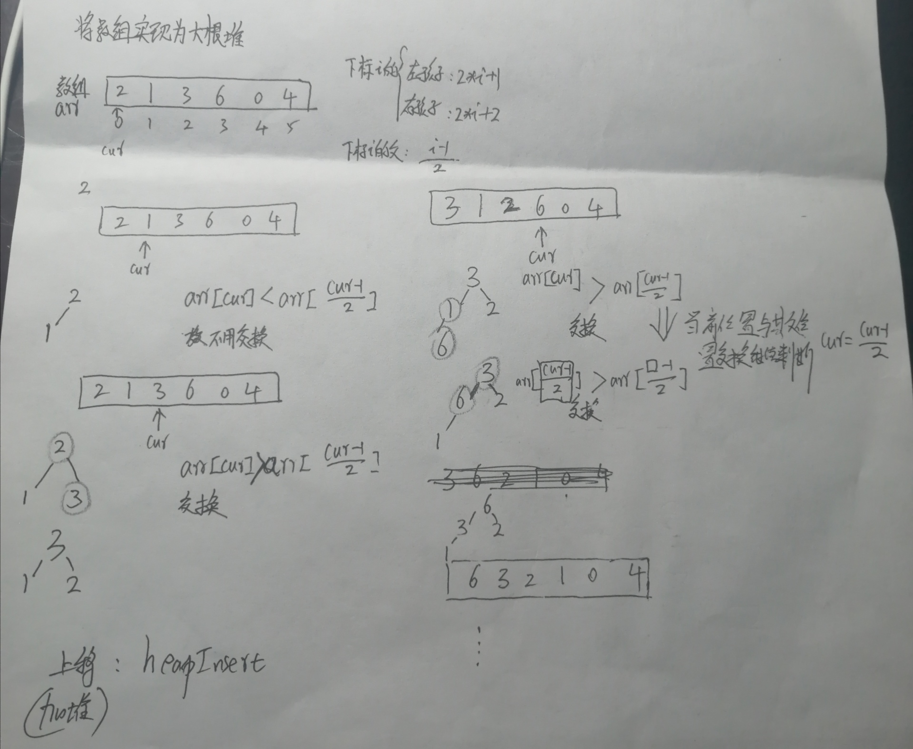
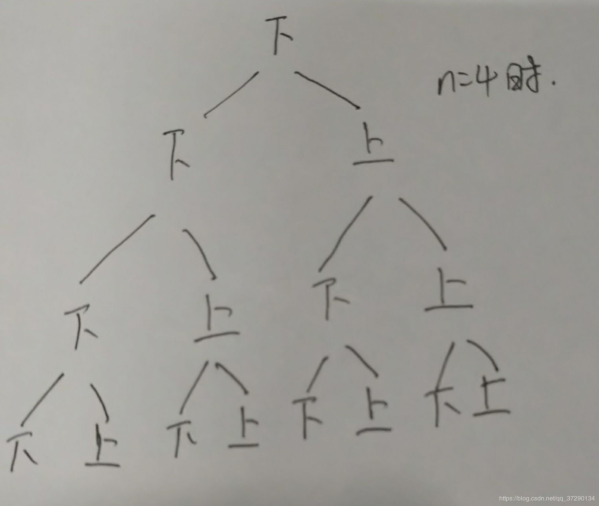
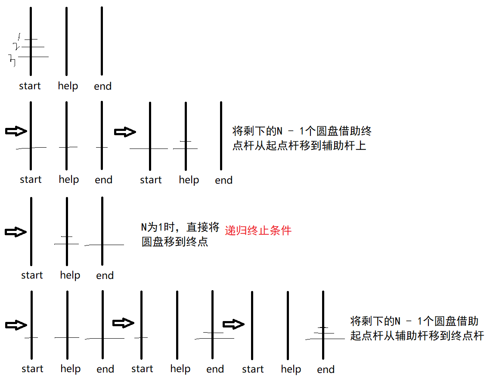

牛客网算法笔记（chengyunzuo@sina.com）

## 第一次课

#### **1**、**时间复杂度**

时间复杂度为一个算法流程中，在最差情况下常数操作数量的指标。常数操作时间为O(1)，读作big O1。

#### **2**、**二分搜索**

1、排序；2、找中间的元素middle；3、target与 middle比较。target>middle，target<middle，target=middle；4、当target不等于middle排除一半。找剩下容器的middle，继续进行。直到找到target或者容器无法再二分。

   **时间复杂度：**O(logN)。**额外空间复杂度**O(1)：只是申请有限个变量且只在原数组上操作。

 若要申请原数组同样长度（的一半）的数组，则额外空间复杂度O(N)。

#### **3**、**冒泡排序**

算法步骤：

- 比较相邻的元素。如果第一个比第二个大，就交换他们两个。
- 对每一对相邻元素作同样的工作，从开始第一对到结尾的最后一对。这步做完后，最后的元素会是最大的数。
- 针对所有的元素重复以上的步骤，除了最后一个。
- 持续每次对越来越少的元素重复上面的步骤，直到没有任何一对数字需要比较。

   **时间复杂度：**O(N*N)。**额外空间复杂度**O(1)。

```java
package 左神算法初级班;

public class Code_00_BubbleSort {
	public static void bubbleSort(int[] arr) {
		if (arr == null || arr.length < 2) {
			return;
		}
		for (int e = arr.length - 1; e > 0; e--) {
			for (int i = 0; i < e; i++) {
				if (arr[i] > arr[i + 1]) {
					swap(arr, i, i + 1);
				}
			}
		}
	}

	public static void swap(int[] arr, int i, int j) {
		arr[i] = arr[i] ^ arr[j];
		arr[j] = arr[i] ^ arr[j];
		arr[i] = arr[i] ^ arr[j];
	}
	
	public static void main(String[] args) {
		int arr[] = {5, 3, 6, 2, 7, 4};
		bubbleSort(arr);
		for (int i = 0; i < arr.length; i++) {
			System.out.print(arr[i]);
		}
	}
}
```

#### **4**、选择排序

算法步骤：

在0 - n-1找一个最小的数，放到0位置；在1 - n-1找一个最小的数放到1位置；....

**时间复杂度：**O(N*N)。**额外空间复杂度**O(1)。

```java
package 左神算法初级班;

public class Code_02_SelectionSort {
	public static void selectionSort(int[] arr) {
		if (arr == null || arr.length < 2) {
			return;
		}
		for (int i = 0; i < arr.length - 1; i++) {
			int minIndex = i;
			for (int j = i + 1; j < arr.length; j++) {
				minIndex = arr[j] < arr[minIndex] ? j : minIndex;
			}
			swap(arr, i, minIndex);
		}
	}

	public static void swap(int[] arr, int i, int j) {
		int tmp = arr[i];
		arr[i] = arr[j];
		arr[j] = tmp;
	}
	
	public static void main(String[] args) {
		int arr[] = {5, 3, 6, 2, 7, 4};
		selectionSort(arr);
		for (int i = 0; i < arr.length; i++) {
			System.out.print(arr[i]);
		}
	}
}

```

#### **5**、插入排序

{从位置为1的元素开始与位置为0的元素比较，如果位置为1的元素小，则交换；否则不交换}。{再比较位置为2和位置为3的元素，若位置为3的元素小，则与位置为2的元素交换；否则不交换。再将交换后的位置1的元素继续与位置0的元素比较，若位置1小则与位置0交换；否则不交换}。…….类似洗牌，将已有的牌排好序，再将新拿到的牌从小到大的插入已有的牌中。

算法步骤：

- 将第一待排序序列第一个元素看做一个有序序列，把第二个元素到最后一个元素当成是未排序序列。
- 从头到尾依次扫描未排序序列，将扫描到的每个元素插入有序序列的适当位置。（如果待插入的元素与有序序列中的某个元素相等，则将待插入元素插入到相等元素的后面。）

   **时间复杂度：**O(N*N)。**额外空间复杂度**O(1)。

```java
package 左神算法初级班;

public class Code_01_InsertionSort {
	public static void insertionSort(int[] arr) {
		if (arr == null || arr.length < 2) {
			return;
		}
		for (int i = 1; i < arr.length; i++) { // 从1开始遍历数组array
			for (int j = i - 1; j >= 0 && arr[j] > arr[j + 1]; j--) {
				swap(arr, j, j + 1);
			}
		}
	}

	public static void swap(int[] arr, int i, int j) {
		arr[i] = arr[i] ^ arr[j];
		arr[j] = arr[i] ^ arr[j];
		arr[i] = arr[i] ^ arr[j];
	}
	
	public static void main(String[] args) {
		int arr[] = {5, 3, 6, 2, 7, 4};
		insertionSort(arr);
		for (int i = 0; i < arr.length; i++) {
			System.out.print(arr[i]);
		}
	}
}
```

#### **6**、对数器

(准备数组、map等的对数器模板)

对数器的概念和使用

0， 有一个你想要测的方法a

1， 实现一个绝对正确但是复杂度不高的方法b

2， 实现一个随机样本产生器

3， 实现比对的方法isequal()

4， 把方法a和方法b比对很多次来验证方法a是否正确。

5， 如果有一个样本使得比对出错， 打印样本分析是哪个方法出错 

6，当样本数量很多时比对测试依然正确， 可以确定方法a已经正确。

 

#### **7**、递归行为的实质及其时间复杂度

**剖析递归行为和递归行为时间复杂度的估算（*递归就是系统在压栈***）

一个递归行为的例子

求出中间值，再分别求左边界到中间的最大值maxL和中间值到右边界的最大值maxR，比较maxL和max得出整个数组的最大值Max；递归下去，直到数组不可再切分。

```java
package 左神算法初级班;
/* 理解递归
 * 利用递归寻找数组中的最大值
 */
public class Code_03_getMax {
	public  static int getMaxNum (int[] arr, int L, int R) {
		//递归终止条件
		if (L == R) {
			return arr[L];
		}
		
		int mid = (L + R) / 2;
		int maxL = getMaxNum(arr, L, mid);
		int maxR = getMaxNum(arr, mid + 1, R);
		int Max = Math.max(maxL, maxR);
		
		return Max;
	}
	
	public static void main(String[] args) {
		int[] arr = {1,9,3,4};
		System.out.println(getMaxNum(arr, 0, arr.length - 1));
	}
}
```

**时间复杂度：**O(N)

​	计算：T(N) = 2xT(N/2) + O(N^0) = 2xT(N/2) + O(1)

​       	log(2,2) = 1 > d=0

​      	 故时间复杂度为：O(N^log(2,2)) = O(N^1) = O(N)

**master公式的使用（子问题划分规则必须一样）**

​	T(N) = a*T(N/b) + O(N^d)

​	1) log(b,a) > d -> 复杂度为O(N^log(b,a))

​	2) log(b,a) = d -> 复杂度为O(N^d * logN)

​	3) log(b,a) < d -> 复杂度为O(N^d)

注：N：父问题的样本量；N/b：子问题的样本量；a：最初父问题化子问题为几个；O(N^d)：除去子过程外，剩下的时间复杂度。

#### **8**、归并排序（重要）

左侧排好；右侧排好(a=2，b=2)；再整体利用外排的方法排序；一个耗尽了，再将另一个剩下的所有都拷入到辅助数组后面；然后将新数组拷贝到原数组O(N)。

算法步骤：

- 申请空间，使其大小为两个已经排序序列之和，该空间用来存放合并后的序列；

- 设定两个指针，最初位置分别为两个已经排序序列的起始位置；

- 比较两个指针所指向的元素，选择相对小的元素放入到合并空间，并移动指针到下一位置；

- 重复步骤 3 直到某一指针达到序列尾；

- 将另一序列剩下的所有元素直接复制到合并序列尾。

  


```java
package 左神算法初级班;
/*
 * 归并排序
 */
public class Code_04_mergeSort {
	/**
	 * 归并分类
	 * @param arr
	 */
	public static void MergeSort (int[] arr) {
		// 如果arr只有一个元素或者arr为空，不用切分
		if (arr.length < 2 || arr == null) {
			return;
		}
		// 将所给数组切分为两半
		Sort(arr, 0, arr.length - 1);		
	}
	/**
	 * 分类
	 * @param arr
	 * @param L
	 * @param R
	 */
	public static void Sort (int[] arr, int L, int R) {
		// 数组不可再分，停止迭代
		if (L == R) {
			return;
		}
		
		// 计算出中间索引;等同于(L + R) / 2
		int mid = L + ((R - L) >> 1);
		// 继续切分左半部分;T(N/2)
		Sort(arr, L, mid);
		// 继续切分右半部分;T(N/2)
		Sort(arr, mid + 1, R);
		// 归并各个两半;O(N)
		merge(arr, L, mid, R);
		// T(N) = 2 T(N/2) + O(N)
	}
	/**
	 * 归并
	 * @param arr
	 * @param l
	 * @param m
	 * @param r
	 */
	public static void merge (int[] arr, int l, int m, int r) {
		// 定义两个指针
		int p1 = l;
		int p2 = m + 1;
		// 定义辅助数组
		int[] help = new int[r - l + 1];
		// 排序并存入辅助数组中
		int i = 0;
		while (p1 <= m && p2 <= r) {
			help[i++] = (arr[p1] < arr[p2]) ? arr[p1++] : arr[p2++];
		}
		while (p1 <= m) { // p1没越界
			help[i++] = arr[p1++];
		}
		while (p2 <= r) { //p2没越界
			help[i++] = arr[p2++];
		}
		// 将辅助数组元素赋值给原数组
		for (i = 0; i < help.length; i++) {
			// 一定是赋值给arr[l + i]而不是arr[i]，因为辅助数组用一次舍弃一次，i初始始终为0，而赋值给原数组应该逐次向后
			arr[l + i] = help[i]; 
		}
	}
	
	public static void main(String[] args) {
		int[] arr = {4, 3, 2, 1};
		MergeSort(arr);
		for (int i = 0; i < arr.length; i++) {
			System.out.print(arr[i]);
		}
	}
}

```

 **注意：**int** mid **=** l **+ ((**r **-** l**) >>** 1**);** // l和r的中点位置，等同于mid = l+(r - l) / 2(下标不会溢出)，mid = (l+r) / 2(会溢出)

#### **9**、小和问题和逆序对问题

**（1）小和问题：**在一个数组中， 每一个数左边比当前数小的数累加起来， 叫做这个数组的小和。 求一个数组的小和。

例子：

[1,3,4,2,5]

1左边比1小的数， 没有；

3左边比3小的数， 1；

4左边比4小的数， 1、 3；

2左边比2小的数， 1；

5左边比5小的数， 1、 3、 4、 2；

所以小和为1+1+3+1+1+3+4+2=16

**代码：（利用归并排序）**

```java
package 左神算法初级班;

public class Code_05_SmallSum {
	public static int smallSum(int[] arr) {
		if (arr == null || arr.length < 2) {
			return 0;
		}
		return mergeSort(arr, 0, arr.length - 1);
	}

	public static int mergeSort(int[] arr, int L, int R) {
		if (L == R) {
			return 0;
		}
		int mid = L + ((R - L) >> 1); // 等同于 mid = l + (r - l) / 2
		//左边小和 + 右边小和 + 左右合并时的小和
		return mergeSort(arr, L, mid) + mergeSort(arr, mid + 1, R) + merge(arr, L, mid, R);
	}

	public static int merge(int[] arr, int l, int m, int r) {
		int[] help = new int[r - l + 1];
		int i = 0;
		int p1 = l;
		int p2 = m + 1;
		int res = 0;
		while (p1 <= m && p2 <= r) {
			// 如果arr[p1]<arr[p2]
			// 小和+ = p2(包括p2)到r(包括r)元素的个数 * arr[p1]
			// 否则 小和+ = 0
			res += arr[p1] < arr[p2] ? (r - p2 + 1) * arr[p1] : 0;
			// 将元素全部存入辅助数组
			help[i++] = arr[p1] < arr[p2] ? arr[p1++] : arr[p2++];
		}
		while (p1 <= m) {
			help[i++] = arr[p1++];
		}
		while (p2 <= r) {
			help[i++] = arr[p2++];
		}
		for (i = 0; i < help.length; i++) {
			arr[l + i] = help[i];
		}
		return res;
	}
	
	public static void main(String[] args) {
		int[] arr = {1, 3, 4, 2, 5};
		System.out.println(smallSum(arr));
	}
}
```

  **（2）逆序对问题：**在一个数组中， 左边的数如果比右边的数大， 则折两个数构成一个逆序对， 请打印所有逆序对。

例子：

如数列 3 5 4 8 2 6 9

(5,4)是一个逆序对，同样还有(3,2),(5,2),(4,2)等等

```java
package 左神算法初级班;
/**
 * 利用归并思想解决逆序对问题
 * @author Lenovo
 *
 */
public class Code_06_ReverseOrder {
	public static int ReverseOrder (int[] arr) {
		// 如果数组元素只有1个或为空数组，不用排序
		if (arr.length < 2 || arr == null) {
			return 0;
		}
		// 将原数组切分成两半
		return Sort(arr, 0, arr.length - 1);
	}
	
	public static int Sort (int[] arr, int L, int R) {
		// 左边界等于右边界时停止切半
		if (L == R) {
			return 0;
		}
		// 计算数组中点
		int mid = L + ((R - L) >> 1);
		
		//左边的逆序对数 + 右边的逆序对数 + 左右合并时的逆序对数
		return Sort(arr, L, mid) +
				 Sort(arr, mid + 1, R) +
				 merge(arr, L, mid, R);
	}
	
	public static int merge (int[] arr, int l, int m, int r) {
		// 两个指针
		int p1 = l;
		int p2 = m + 1;
		// 辅助数组
		int i = 0;
		int[] help = new int[r - l + 1];
		// 逆序对数
		int num = 0;
		// 排序各段并存放到辅助数组中
		while (p1 <= m && p2 <= r) {
			// 如果左边数 > 右边数
			// 逆序对数 = m到l之间的个数
			num += (arr[p1] > arr[p2]) ? (m - l + 1) : 0;
			help[i++] = (arr[p1] <= arr[p2]) ? arr[p1++] : arr[p2++];
		}
		//左半部分没存完
		while (p1 <= m) {
			help[i++] = arr[p1++];
		}
		//右半部分没存完
		while (p2 <= r) {
			help[i++] = arr[p2++];
		}
		//将辅助数组元素拷贝到原数组
		for(i = 0; i < help.length; i++) {
			arr[l + i] = help[i];
		}
		
		return num;
	}
	
	public static void main(String[] args) {
		int[] arr = {1, 2, 3, 4, 5, 6, 7, 0, 8};
		System.out.println("逆序对数量：" + ReverseOrder(arr));
	}
}
```


## 第二次课

#### 1、荷兰国旗问题（划分问题）

（1）引例：

给定一个数组arr， 和一个数num， 请把小于等于num的数放在数组的左边， 大于num的数放在数组的右边。

要求**额外空间复杂度**O(1)， **时间复杂度**O(N) 。 

思路：


```java
package 左神算法初级班;

import java.util.Arrays;

public class Code_07_NetherlandsFlagIn {
    /**
     * 划分问题
     * @param arr 测试数组
     * @param cur 当前遍历到的位置
     * @param r 测试数组的右边界
     * @param num 需比较的值
     */
    public static void partition(int[] arr, int cur, int r, int num) {
        // 小于区域的右边界
        int less = cur - 1;
        // 交换
        // 当current到数组末尾时停止划分
        while (cur <= (arr.length - 1)) {
            if (arr[cur] <= num) {
                Swap(arr, cur++, ++less);
            } else {
                cur++;
            }
        }
    }

    public static void Swap(int[] arr, int i, int j) {
        int temp = arr[j];
        arr[j] = arr[i];
        arr[i] = temp;
    }

    public static void main(String[] args) {
        // 测试数组
        int[] arr = {8, 5, 4, 7, 6};
        partition(arr, 0, arr.length - 1, 6);
        System.out.print(Arrays.toString(arr));
    }
}
```

（2）荷兰国旗问题（partition（划分）问题）：

给定一个数组arr， 和一个数num， 请把小于num的数放在数组的左边， 等于num的数放在数组的中间， 大于num的数放在数组的右边。

要求**额外空间复杂度**O(1)， **时间复杂度**O(N)  

思路：


```java
package 左神算法初级班;

import java.util.Arrays;

public class Code_08_NetherlandsFlag {
    /**
     * 划分问题
     * @param arr 测试数组
     * @param current 当前遍历到的位置
     * @param r 测试数组的右边界
     * @param num 需比较的值
     */
    public static void partition(int[]arr, int current, int r ,int num) {
        // 定义小于区域的右边界
        int less = current - 1;
        // 定义大于区域的左边界
        int more = r + 1;
        // 判断并交换
        // 当前位置与大于区域的左边界时
        while (current != more) { // 当前位置重叠大于区域左边界位置时停止划分
            if (arr[current] < num) { // 当前位置元素小于num
                // 当前位置元素与小于区域右边界下一位位置元素交换，当前位置右移一位，小于区域右边界右移一位
                Swap(arr, current++, ++less);
            }else if (arr[current] == num) { // 当前位置元素等于num
                // 当前位置右移一位
                current++;
            }else { // 当前位置元素大于num
                // 当前位置元素与大于区域左边界前一位元素交换，当前位置不变，大于区域左边界左移一位
                Swap(arr, current, --more);
            }
        }
    }

    public static void Swap(int[] arr, int i, int j) {
        int temp = arr[i];
        arr[i] = arr[j];
        arr[j] = temp;
    }

    public static void main(String[] args) {
        // 创建测试数组
        int[] arr = {1, 5, 3, 4, 2, 8};
        // 调用划分方法
        partition(arr, 0, arr.length - 1, 5);
        // 将划分后的字符串打印
        System.out.println(Arrays.toString(arr));
    }
}
```


#### 2、快速排序（重要）

##### （1）经典快排

利用荷兰国旗的partition划分思想，每次都以**数组arr最后一个元素为比较对象num**。

经典快排将数组分为三部分：

算法步骤：

- 从数列中挑出一个元素，称为 “基准”（pivot）;
- 重新排序数列，所有元素比基准值小的摆放在基准前面，所有元素比基准值大的摆在基准的后面（相同的数可以到任一边）。在这个分区退出之后，该基准就处于数列的中间位置。这个称为分区（partition）操作；
- 递归地（recursive）把小于基准值元素的子数列和大于基准值元素的子数列排序

缺点：与数据状况有关，最差，即没有等于区域。如{1， 2， 3， 4}，时间复杂度为O(N^2)。

​                                          最好，存在等于区域，时间复杂度为O(N*logN)。

##### （2）左神改进的经典快排

利用荷兰国旗的partition划分思想，每次都以**数组arr最后一个元素为比较对象num**。且下次比较的是小于区域和大于区域的数组，等于区域不再partition。

将数组分为四个部分：

优点：与数据状况无关，时间复杂度为O(N*logN)。

例子：


```java
package 左神算法初级班;
/*
 * 左神改进的快排
 * 加上swap(arr, l + (int) (Math.random() * (r - l + 1)), r);变为随机排序
 * 将数组分为四部分：【小于区+等于区+待定区+大于区】末尾arr[r]不参与partition
 */
import java.util.Arrays;

public class Code_10_RandomSort {
    /**
     * 快排(判断数组是否为空/为单个元素)
     * @param arr 待排数组
     */
    public static void quickSort(int[] arr) {
        if (arr == null || arr.length < 2) {
            return;
        }
        quickSort(arr, 0, arr.length - 1);
    }

    /**
     * 快排
     * @param arr 待排数组
     * @param cur quickSort当前位置
     * @param r 待排数组右边界
     */
    public static void quickSort(int[] arr, int cur, int r) {
        if (cur < r) {
            swap(arr, cur + (int) (Math.random() * (r - cur + 1)), r);
            int[] p = partition(arr, cur, r);
            quickSort(arr, cur, p[0] - 1);
            quickSort(arr, p[1] + 1, r);
        }
    }

    /**
     * 划分
     * @param arr 待排数组
     * @param Cur partition当前位置
     * @param R 待排数组右边界
     * @return 等于区域的首尾
     */
    public static int[] partition(int[] arr, int Cur, int R) {
        int less = Cur - 1;
        // 直接用arr[r]作为比对数字，且arr[r]不参与partition
        int more = R;
        while (Cur < more) {
            if (arr[Cur] < arr[R]) {
                swap(arr, ++less, Cur++);
            } else if (arr[Cur] > arr[R]) {
                swap(arr, --more, Cur);
            } else {
                Cur++;
            }
        }
        // 将末尾arr[r]与大于区域的第一个数交换，将数组变为【小于区+等于区+大于区】
        swap(arr, more, R);
        return new int[] { less + 1, more };
    }

    public static void swap(int[] arr, int i, int j) {
        int tmp = arr[i];
        arr[i] = arr[j];
        arr[j] = tmp;
    }

    public static void main(String[] args) {
        int[] arr = {3, 4, 5, 4, 6};
        quickSort(arr);
        System.out.print(Arrays.toString(arr));
    }
}
```

##### （3）随机快排

不选取数组最后一个元素为比较对象num，随机再数组中选一个元素与数组中最后一个元素交换，然后进行parathion划分。

**时间复杂度**是由长期期望算出的：O(N*logN)。**额外空间复杂度**是由长期期望算出的：O(logN)。


#### 3、堆排序（重要）

##### （1）堆结构：其实是完全二叉树。

​         完全二叉树：1> 满二叉树：非叶子节点左右孩子都全的二叉树。

​                                2> 不是满二叉树，但是新的一层是从左往右依次补齐的二叉树。


   堆结构与完全二叉树（脑海中的结构，实际落地就是数组结构，是在元**素下标对应关系下**才想象成完全二叉树）的对应关系：


##### 	（2）堆分类：

​			大根堆：在完全二叉树中任何一颗子树的最大值是这棵树的头部所形成的结构叫大根堆。

​			小根堆：在完全二叉树中任何一颗子树的最小值是这棵树的头部所形成的结构叫小根堆。


##### 	（3）加堆：heapInsert

​			加堆：上移（捕获新的数进入大根堆中）：函数heapInsert

​			思路：**时间复杂度：**O(N)。



##### 	

```java
    /**
     * 加堆：上移（捕获新的数进入大根堆中）
     * @param arr 待排数组
     * @param cur 当前位置
     */
    public static void heapInsert(int[] arr, int cur) {
        // 父位置（index - 1) / 2
        while (arr[cur] > arr[(cur - 1) / 2]) {
            swap(arr, cur, (cur - 1) / 2);
            // 当前位置挪到当前位置的父位置处继续判断
            cur = (cur - 1) / 2;
        }
    }
```

##### （4）减堆：heapify

​		减堆：下沉（去掉大根堆中变小的数，剩下的还要是大根堆）：函数heapify

​		思路：**时间复杂度：**O(N)。


```java
	/**
     * 减堆：下沉（去掉大根堆中已有的数，剩下的还要是大根堆）
     * @param Arr 剩下的数组
     * @param Cur 当前位置
     * @param size 剩下数组的长度，size <= arr.length()
     */
    public static void heapify(int[] Arr, int Cur, int size) {
        int left = Cur * 2 + 1;
        // 判断当前位置的左孩子有没有越右边界
        while (left < size) {
            // 左孩子和右孩子(不越当前堆的边界)谁大，谁的下标就是largest
            int largest = left + 1 < size && Arr[left + 1] > Arr[left]
                    ? left + 1
                    : left;
            // 左右孩子的最大值和当前位置谁大，谁就是largest
            largest = Arr[largest] > Arr[Cur]
                    ? largest
                    : Cur;
            // 如果当前位置和左右孩子相比，最大值是当前位置，则当前位置不用向下沉
            if (largest == Cur) {
                break;
            }
            // 否则将当前位置元素和largest位置元素交换
            swap(Arr, largest, Cur);
            // 将当前位置挪到largest位置处，即当前位置向下沉
            Cur = largest;
            // 继续寻找当前位置的左孩子
            left = Cur * 2 + 1;
        }
    }
```

##### 	（5）堆排序的实现

给定数组arr。 

算法步骤：

- 将数组整体形成大根堆；

- 将最后一个位置与0位置（堆顶：最大的数）交换，堆的长度减1，剩下的arr做heapify调整为大根堆；

- 当堆长度 > 0，重复步骤2。

  **时间复杂度**：O(N*logN)， **额外空间复杂度：**O(1)
  ​	

​		 注意：堆结构非常重要
​				1， 堆结构的heapInsert与heapify
​				2， 堆结构的增大和减少
​				3， 如果只是建立堆的过程， 时间复杂度为O(N)
​				4， 优先级队列结构， 就是堆结构  


#### 4、排序算法的稳定性及其汇总

排序算法的稳定性：能否保证排序后元素的原始相对位置不变。

（1）时间复杂度：O(N^2)，额外空间复杂度：O(1)

​		冒泡：稳定，遇到相邻是相同的数，让后一个数去和后面的数比较，再决定是否交换。这样冒泡排序就是稳定的；

​		插入排序：稳定，同冒泡排序，前移时，遇到相邻是相同的数，让前一个数去和前面的数比较，再决定是否交换。这样插入排序就是稳定的；

​		**选择排序**：**不稳定**。

（2）时间复杂度：O(N*logN)

​		归并排序：稳定；额外空间复杂度：O(N)

​		**快速排序**：**不稳定**；额外空间复杂度：O(logN)

​		**堆排序**：**不稳定**。额外空间复杂度：O(1)


#### 5、介绍一下工程中的综合排序算法

如果是很长的数组（>60），先进行归并排序（时间复杂度小），如果长度小于60且是基本类型则进行快排（因为常数项低，O(N^2)的缺点不明显），若是自己定义的类型则利用归并排序（稳定）。


#### 6、有关排序问题的补充

1，归并排序的额外空间复杂度可以变成O(1)，但是非常难，不需要掌握，可以搜“归并排序 内部缓存法”
2，快速排序可以做到稳定性问题，但是非常难，不需要掌握，可以搜“01 stable sort”
3，有一道题目，是奇数放在数组左边，偶数放在数组右边，还要求原始的相对次序不变，碰到这个问题，可以怼面试官。面试官非良人。


#### 7、比较器

**应用范围：当面试题中包含排序但不全是排序可以使用比较器快速排好序。**

Java的一些常用类已经实现了Comparable接口，并提供了比较大小的标准。包装类：按照它们对应的数值大小进行比较。Character,Boolean,String,Date,Time等也都实现了Comparable接口。 

​	1、自己定义的类继承Comparator接口；

​	2、接口里面放着待比较的对象类型；

​	3、类里面写着重写的compare方法（自己定义的大小关系）；

​	4、排序的时候告诉排序的规则（new自己定义的比较器）。

**重写方法：**int compare(Object obj1, Object obj2)

**默认：**返回负数：前面的小；返回正数：后面的小；返回0：相等。

**例1**

```java
// 1、自己定义的类继承Comparator接口
public static class IdDescendingComparator implements Comparator<Student> {  // 2、接口里面放着待比较的对象类型Student

    @Override
    // 3、类里面写着重写的compare方法（自己定义的大小关系：前大返回负数、后大返回正数、等于返回0）
    public int compare(Student o1, Student o2) {
       return o2.id - o1.id;
    }
}
```

```java
// 4、根据指定比较器产生的顺序对指定对象数组的指定范围进行排序
Arrays.sort(students, new IdAscendingComparator());
```

**例2**

```java
// 1、自己定义的类继承MyComparator接口
public static class MyComparator implements Comparator<String> { // 2、接口里面放着待比较的对象类型String
     @Override
     // 3、类里面写着重写的compare方法
     public int compare(String a, String b) {
     	// String类的compareTo()：按字典顺序比较两个字符串，前小后大返回负数
        return (a + b).compareTo(b + a);
   	 }
}
```

```java
// 4、根据指定比较器产生的顺序对指定对象数组的指定范围进行排序
Arrays.sort(strs, new MyComparator());
```


#### 8、桶排序、计数排序、基数排序的介绍

- 非基于比较的排序，与被排序的样本的实际数据状况很有关系，所以实际中并不经常使用；
- 时间复杂度O(N)，额外空间复杂度O(N)；
- 稳定的排序。

**1、桶排序：** 工作的原理是将数组分到有限数量的桶子里。每个桶子再个别排序（有可能再使用别的排序算法或是以递归方式继续使用桶排序进行排序）。

当输入的元素是n个0到k之间的整数时，**时间复杂度**：**O(n^2)**。**额外空间复杂度**：**O(nk)**。

算法步骤：

- 设置一个定量的数组当作空桶子。

- 寻访序列，并且把项目一个一个放到对应的桶子去。

- 对每个不是空的桶子进行排序。

- 从不是空的桶子里把项目再放回原来的序列中。

  

**2、计数排序：**使用一个额外的数组C，其中C的第i个元素是待排数组A中值等于I的元素的个数。然后根据数组C来将A 中的元素排到正确的位置。

算法步骤：

- 花O(n)的时间扫描一下整个序列 A，获取最小值 min 和最大值 max
- 开辟一块新的空间创建新的数组 B，长度为 ( max - min + 1)
- 数组 B 中 index 的元素记录的值是 A 中某元素出现的次数
- 最后输出目标整数序列，具体的逻辑是遍历数组 B，输出相应元素以及对应的个数

当输入的元素是n个0到k之间的整数时，**时间复杂度**：**O(n+k)**。**额外空间复杂度**：**O(n+k)**。


**3、基数排序：**将所有待比较数值（正整数）统一为同样的数位长度，数位较短的数前面补零。然后，从最低位开始，依次进行一次排序。这样从最低位排序一直到最高位排序完成以后，数列就变成一个有序序列。

算法步骤：

- 将所有待比较数值（正整数）统一为同样的数位长度，数位较短的数前面补零
- 从最低位开始，依次进行一次排序
- 从最低位排序一直到最高位排序完成以后, 数列就变成一个有序序列

当输入的元素是n个0到k之间的整数时，**时间复杂度**：**O(nk)**。**额外空间复杂度**：**O(n+k)**。

##### **补充问题**（重要）

​	  给定一个数组，求如果排序之后，相邻两数的最大差值，要求时间复杂度O(N)，且要求不能用非基于比较的排序。

**此题桶的分法：**N个数准备N+1个桶，遍历一遍找到min和max。如果min == max，说明数组都是一种数，即最大差值为0；如果min  != max，最小值放到0号桶里，最大值放到N号桶里，将最小值到最大值这个范围等分成N+1份，一个数属于哪个桶（范围）就放到哪个桶里。

比如：


**这样分的目的：**中间必存至少存在一个空桶。空桶左右两侧必定都存在非空桶，左边非空桶的最大值与右边非空桶的最小值，在排序之后一定是相邻的，且两者的差值一定大于空桶表示的范围的差值。而一个非空桶内部的最大值与最小值之差一定小于等于非空桶表示的范围的差值。**所以最大差值一定不存在同一个非空桶。**

**但最大差值不一定是空桶的两边的非空桶产生的。**反例如下：


**最大差值只会是两个不同桶，而且是前一个非空桶的最大值与离其最近的后一个非空桶的最小值产生的差值。**

**程序流程：**分桶；遍历arr；一个桶只有三个变量：boolean、min、max；找所有非空桶(min)及离其最近的前一个非空桶(max)，求所有min与max的差值x；再求所有x的最大值即为最大差值。

**代码**

```java
package 左神算法初级班;

public class Code_14_MaxGap {
    public static int maxGap(int[] nums) {
        // 如果数组为空或只有1个元素，最大差值为0
        if (nums == null || nums.length < 2) {
            return 0;
        }
        int len = nums.length;
        // 将最大设为最小，最小设为最大
        int min = Integer.MAX_VALUE;
        int max = Integer.MIN_VALUE;
        // 遍历数组找到数组中的最大最小值
        for (int i = 0; i < len; i++) {
            // 与已知最小值比较，如果更小就更新
            min = Math.min(min, nums[i]);
            max = Math.max(max, nums[i]);
        }
        // 最小值等于最大值说明数组存的同一个数，最大差值为0
        if (min == max) {
            return 0;
        }
        // len+1个桶中存的3个信息
        boolean[] hasNum = new boolean[len + 1];
        int[] maxs = new int[len + 1];
        int[] mins = new int[len + 1];
        int bid = 0;
        // 再次遍历数组arr，确定数组中的每个数在几号桶，并更新该桶的3个参数
        for (int i = 0; i < len; i++) {
            bid = bucket(nums[i], len, min, max);
            mins[bid] = hasNum[bid] ? Math.min(mins[bid], nums[i]) : nums[i];
            maxs[bid] = hasNum[bid] ? Math.max(maxs[bid], nums[i]) : nums[i];
            hasNum[bid] = true;
        }
        int res = 0;
        int lastMax = maxs[0];
        int i = 1;
        // 找到每一个非空桶和离他最近的左边非空桶，用当前的最小 - 前一个的最大算出的差值看看是否找到了更大的差值
        for (; i <= len; i++) {
            if (hasNum[i]) {
                res = Math.max(res, mins[i] - lastMax);
                lastMax = maxs[i];
            }
        }
        return res;
    }

    /**
     * 确定当前数属于几号桶
     * @param num 当前数
     * @param len 桶的个数
     * @param min arr的最小值
     * @param max arr的最大值
     * @return 桶号
     */
    public static int bucket(long num, long len, long min, long max) {
        return (int) ((num - min) * len / (max - min));
    }

    public static void main(String[] args) {
        int[] arr = {6, 5, 4, 3, 5, 2};
        System.out.print(maxGap(arr));
    }
}
```


## 第三次课

### 一、数组、栈、队列

#### 1、用静态数组结构实现大小固定的队列和栈（重要）

题目描述：用静态数组结构实现大小固定的队列和栈

（1）实现大小固定的栈

思路： 栈结构是先进后出的，只需要一个数组和一个记录位置的变量index，当进来一个元素，该元素就放到index位置，index++，取出一个元素就是取出index处的元素，index--。 当index等于数组长度size就报错，表示栈满；当index等于-1也报错，表示栈空了。


（1）实现大小固定的队列

思路：相对栈结构要难搞一些，队列的先进先出的，需要一个数组和三个变量，size表示已经进来了多少个元素，end表示刚进来的元素应该放在哪个位置，start表示用户要求取出的元素所在的位置。

​			初始，start和end都处于0位置。只要size没超数组的长度，就总把进来的数放到end位置上；只要size不为0，总把start处的数取出。所以start和end是解耦的。

​			end的运动逻辑：只要end到底，end就回到0位置，end不到底，end++。start同end的运行逻辑。只是end、start分别与size的关系不一样。

```java
package 左神算法初级班;

public class Code_15_Array_To_Stack_Queue {
    public static class ArrayStack {
        private Integer[] arr; // 所给的数组
        private Integer index; // 当前位置

        /**
         * 实现栈结构
         * @param initSize 数组长度
         */
        public ArrayStack(int initSize) {
            if (initSize < 0) {
                throw new IllegalArgumentException("The init size is less than 0");
            }
            // 初始化
            arr = new Integer[initSize];
            index = 0;
        }
        // 取（留）
        public Integer peek() {
            if (index == 0) {
                return null;
            }
            // index值不变
            return arr[index - 1];
        }
        // 栈中加数
        public void push(int obj) {
            if (index == arr.length) {
                throw new ArrayIndexOutOfBoundsException("The Stack is full");
            }
            arr[index++] = obj;
        }
        // 取（不留）
        public Integer pop() {
            if (index == 0) {
                throw new ArrayIndexOutOfBoundsException("The Stack is empty");
            }
            // --index：index = index - 1
            return arr[--index];
        }
    }

    public static class ArrayQueue {
        private Integer[] arr; // 所给的数组
        private Integer size; // 已经进来了多少个元素
        private Integer start; // 用户要求取出的元素所在的位置
        private Integer end; // 刚进来的元素应该放在哪个位置

        /**
         * 实现队列结构
         * @param initSize 数组长度
         */
        public ArrayQueue(int initSize) {
            if (initSize < 0) {
                throw new IllegalArgumentException("The init size is less than 0");
            }
            // 初始化
            arr = new Integer[initSize];
            size = 0;
            start = 0;
            end = 0;
        }
        // 取（留）
        public Integer peek() {
            if (size == 0) {
                return null;
            }
            return arr[start];
        }
        // 存
        public void push(int obj) {
            // size等于数组长度则不能加东西
            if (size == arr.length) {
                throw new ArrayIndexOutOfBoundsException("The queue is full");
            }
            // 否则可以加
            size++;
            arr[end] = obj;
            // 只要end到底，end就回到0位置，end不到底，end++
            end = end == arr.length - 1 ? 0 : end + 1;
        }
        // 取（不留）
        public Integer poll() {
            // 队列已经为空
            if (size == 0) {
                throw new ArrayIndexOutOfBoundsException("The queue is empty");
            }
            size--;
            int tmp = start;
            start = start == arr.length - 1 ? 0 : start + 1;
            return arr[tmp];
        }
    }

    public static void main(String[] args) {

    }
}

```

#### 2、实现一个特殊的栈（重要）

题目描述：实现一个特殊的栈，在实现栈的基本功能的基础上，再实现返回栈中最小元素的操作。 
【要求】 

1. pop、push、getMin操作的时间复杂度都是O(1)。 
2. 设计的栈类型可以使用现成的栈结构。

思路：

准备一个Data栈，min栈。Data栈正常压栈；如果min栈为空则直接将Data栈进来的数压栈，如果不为空，min栈顶与Data栈每次进来的数作比较。若min栈顶的数小与Data栈刚进来的数，min栈将自己栈顶的数压到min栈，否则min栈将Data栈刚进来的数压至自己栈。这样min栈顶永远保存的是Data栈中的最小元素。取出的时候Data栈和min栈同时取出，若Data栈取出的数等于min栈取出的数，则该数为Data栈中最小数。


```java
package 左神算法初级班;

import java.util.Stack;

public class Code_16_GetMinStack {
    public static class MyStack {
        private Stack<Integer> stackData;
        private Stack<Integer> stackMin;

        public MyStack() {
            this.stackData = new Stack<Integer>();
            this.stackMin = new Stack<Integer>();
        }
        // 存
        public void push(int newNum) {
            // min栈压栈思路
            if (this.stackMin.isEmpty()) {
                this.stackMin.push(newNum);
            } else if (newNum <= this.getmin()) {
                this.stackMin.push(newNum);
            }
            // Data栈正常压栈
            this.stackData.push(newNum);
        }
        // 取及取出Data栈中最小数
        public int pop() {
            if (this.stackData.isEmpty()) {
                throw new RuntimeException("Your stack is empty.");
            }
            int value = this.stackData.pop();
            if (value == this.getmin()) {
                this.stackMin.pop();
            }
            return value;
        }

        public int getmin() {
            if (this.stackMin.isEmpty()) {
                throw new RuntimeException("Your stack is empty.");
            }
            return this.stackMin.peek();
        }
    }

    public static void main(String[] args) {
        MyStack stack1 = new MyStack();
        stack1.push(3);
        System.out.println(stack1.getmin());
        stack1.push(4);
        System.out.println(stack1.getmin());
        stack1.push(1);
        System.out.println(stack1.getmin());
        System.out.println(stack1.pop());
        System.out.println(stack1.getmin());
    }
}
```

#### 3、队列结构实现栈结构or反过来（重要）

题目描述：（1）如何仅用队列结构实现栈结构？ （2）如何仅用栈结构实现队列结构？

（1）思路：用两个队列Data、help队列，用户取一个数的时候，Data队列将最后一个进入的数留着给用户返回，其余的数存到help队列，再将help队列中的数放回Data队列。用户取第二个数的时候，Data继续只留一个，......


（2）思路：用两个栈结构push、pop栈，用户存一个数永远进push栈，取一个数永远从pop栈取。

有两个限制：1.如果push要将数倒入pop，必须一次倒完；2.如果pop栈里面有东西，push栈一定不要倒。


```java
package 左神算法初级班;

import java.util.LinkedList;
import java.util.Queue;
import java.util.Stack;

class Code_17_StackAndQueueConvert {
    public static class TwoStacksQueue {
        private Stack<Integer> stackPush;
        private Stack<Integer> stackPop;

        public TwoStacksQueue() {
            stackPush = new Stack<Integer>();
            stackPop = new Stack<Integer>();
        }

        public void push(int pushInt) {
            stackPush.push(pushInt);
            dao();
        }

        public int poll() {
            if (stackPop.empty() && stackPush.empty()) {
                throw new RuntimeException("Queue is empty!");
            }
            dao();
            return stackPop.pop();
        }

        public int peek() {
            if (stackPop.empty() && stackPush.empty()) {
                throw new RuntimeException("Queue is empty!");
            }
            dao();
            return stackPop.peek();
        }

        public void dao() {
            // 限制1：如果pop栈不为空
            if (!stackPop.isEmpty()) {
                // 不能倒
                return;
            }
            // 限制2：如果pop栈为空,一次倒完
            while (!stackPop.isEmpty()) {
                stackPop.push(stackPush.pop());
            }
        }
    }


    public static class TwoQueuesStack {
        private Queue<Integer> Data;
        private Queue<Integer> help;

        public TwoQueuesStack() {
            Data = new LinkedList<Integer>();
            help = new LinkedList<Integer>();
        }

        public void push(int pushInt) {
            Data.add(pushInt);
        }

        public int peek() {
            if (Data.isEmpty()) {
                throw new RuntimeException("Stack is empty!");
            }
            while (Data.size() != 1) {
                help.add(Data.poll());
            }
            int res = Data.poll();
            help.add(res);
            swap();
            return res;
        }

        public int pop() {
            if (Data.isEmpty()) {
                throw new RuntimeException("Stack is empty!");
            }
            // 只要Data队列中不止一个数，Data队列将最后一个进入的数留着给用户返回，其余的数存到help队列
            while (Data.size() > 1) {
                help.add(Data.poll());
            }
            // 将Data队列剩下的数弹出来给用户
            int res = Data.poll();
            // 再将help栈元素给Data栈，
            // 即改引用：help栈变Data栈，Data栈变help栈
            swap();

            return res;
        }

        private void swap() {
            Queue<Integer> tmp = help;
            help = Data;
            Data = tmp;
        }

    }
}
```

#### 4、题目四：猫狗队列

实现一种狗猫队、列的结构，要求如下：

1. 用户可以调用 `add` 方法将cat类或dog类的实例放入队列中；
2. 用户可以调用 `pollAll` 方法，将队列中所有的实例按照进队列的先后顺序依次弹出；
3. 用户可以调用 `pollDog` 方法，将队列中dog类的实例按照进队列的先后顺序依次弹出；
4. 用户可以调用 `pollCat` 方法，将队列中cat类的实例按照进队列的先后顺序依次弹出；
5. 用户可以调用 `isEmpty` 方法，检查队列中是否还有dog或cat的实例；
6. 用户可以调用 `isDogEmpty` 方法，检查队列中是否有dog类的实例；
7. 用户可以调用 `isCatEmpty` 方法，检查队列中是否有cat类的实例。

核心思想

​    1.设计一个pet的包装类型，包装类型中加上 count 表示这个实例对象是第几个被添加的，这样可以在执行 `pollAll()` 的时候根据 count 来决定返回哪一个对象。

​    2.设计两个队列，两个队列中放的都是包装类型的对象。

​    3.push的时候把要入队列的对象先包装起来，再放入队列中。

```java
Code_18_DogCatQueue
```


### 二、宏观思维解决打印问题

#### 5、题目五：转圈打印矩阵

例子：


思路：

（1）矩阵是行向量或列向量怎么打印：


（2）4个while循环打印t、c不在同一直线的情况：


（3）由外圈向内圈过渡：


（4）重复直至左上角点的行或列有一个大于右下角的行或列时停止打印。

```java
package 左神算法初级班03;
/**
 * 转圈打印矩阵
 * 利用两个点：左上角t、右下角d
 */
class Code_19_PrintMatrixSpiralOrde {
    // 左上角、右下角确定一个矩形区域
    // 改变左上角、右下角向内扩
    public static void printMatrix(int [][] matrix) {
        // 左上角
        int tr = 0, tc = 0;
        // 右下角
        int dr = matrix.length - 1;
        int dc = matrix[0].length - 1;

        // 当左上角点与右下角点不冲突时一直顺时针打印
        while (tr <= dr && tc <= dc) {
            printMatrix(matrix, tr++, tc++, dr--, dc--);
        }
    }

    public static void printMatrix(int[][] m, int tR, int tC, int dR, int dC) {
        // 两个特殊情况
        // 当tc = dc时,即m是列向量时
        if (tC == dC) {
            for (int i = tR; i <= dR; i++) {
                System.out.print(m[i][tC] + " ");
            }
        } else if (tR == dR) { // 当tr = dr时,即m是行向量时
            for (int i = tC; i <= dC; i++) {
                System.out.print(m[tR][i] + " ");
            }
        }else {
            // 顺时针分别打印四个边上的元素
            int curR = tR, curC = tC; // 当前位置
            while (curC < dC) {
                System.out.print(m[tR][curC++] + " ");
            }
            while (curR < dR) {
                System.out.print(m[curR++][dC] + " ");
            }
            while (curC > tC) {
                System.out.print(m[dR][curC--] + " ");
            }
            while (curR > tR) {
                System.out.print(m[curR--][tC] + " ");
            }
        }
    }

    public static void main(String[] args) {
        int[][] matrix = { {1, 2, 3, 4}, {5, 6, 7, 8},
                        {9, 10, 11, 12}, {13, 14, 15, 16}};
        printMatrix(matrix);
    }
}
```


#### 6、题目六：旋转正方形矩阵

【题目】 给定一个整型正方形矩阵matrix，请把该矩阵调整成顺时针旋转90度的样子。
【要求】 额外空间复杂度为O(1)。

思路：


```java
package 左神算法初级班;

public class Code_20_RotateMatrix {
    public static void rotate(int[][] matrix) {
        int tR = 0;
        int tC = 0;
        int dR = matrix.length - 1;
        int dC = matrix[0].length - 1;
        while (tR < dR) {
            rotateEdge(matrix, tR++, tC++, dR--, dC--);
        }
    }

    public static void rotateEdge(int[][] m, int tR, int tC, int dR, int dC) {
        int times = dC - tC;
        int tmp = 0;
        for (int i = 0; i != times; i++) {
            tmp = m[tR][tC + i];
            m[tR][tC + i] = m[dR - i][tC];
            m[dR - i][tC] = m[dR][dC - i];
            m[dR][dC - i] = m[tR + i][dC];
            m[tR + i][dC] = tmp;
        }
    }

    public static void printMatrix(int[][] matrix) {
        for (int i = 0; i != matrix.length; i++) {
            for (int j = 0; j != matrix[0].length; j++) {
                System.out.print(matrix[i][j] + " ");
            }
            System.out.println();
        }
    }

    public static void main(String[] args) {
        int[][] matrix = { { 1, 2, 3, 4 }, { 5, 6, 7, 8 }, { 9, 10, 11, 12 },
                { 13, 14, 15, 16 } };
        printMatrix(matrix);
        rotate(matrix);
        System.out.println("=========");
        printMatrix(matrix);
    }
}
```


#### 7、题目六：反转单向和双向链表

【题目】 分别实现反转单向链表和反转双向链表的函数。
【要求】 如果链表长度为N，时间复杂度要求为O(N)，额外空间复杂度要求为O(1)

```java
package 左神算法初级班;

public class Code_21_ReverseList {
    // 单向链表节点
    public static class Node {
        public int value;
        public Node next;

        public Node(int data) {
            this.value = data;
        }
    }

    /**
     * 单向链表
     * 遍历反转法：从前往后反转各个结点的指针域的指向。
     * @param head 头节点
     * @return 新的头节点
     */
    public static Node reverseList(Node head) {
        Node pre = null;
        Node next = null;
        while (head != null) {
            // 将当前节点的下一个节点存起来
            next = head.next;
            // 反转当前节点的指针域
            head.next = pre;
            // 处理下一个节点
            pre = head;
            head = next;
        }
        return pre;
    }

    // 双向链表节点
    public static class DoubleNode {
        public int value;
        public DoubleNode last;
        public DoubleNode next;

        public DoubleNode(int data) {
            this.value = data;
        }
    }
    /**
     * 双向链表
     * 遍历反转法：从前往后反转各个结点的两个指针域的指向。
     * @param head 头节点
     * @return 新的头节点
     */
    public static DoubleNode reverseList(DoubleNode head) {
        DoubleNode pre = null;
        DoubleNode next = null;
        while (head != null) {
            // 存当前节点的下一个节点
            next = head.next;
            // 反转当前节点的指针域
            head.next = pre;
            head.last = next;
            // 处理下一个节点
            pre = head;
            head = next;
        }
        return pre;
    }

    public static void printLinkedList(Node head) {
        System.out.print("Linked List: ");
        while (head != null) {
            System.out.print(head.value + " ");
            head = head.next;
        }
        System.out.println();
    }

    public static void printDoubleLinkedList(DoubleNode head) {
        System.out.print("Double Linked List: ");
        DoubleNode end = null;
        while (head != null) {
            System.out.print(head.value + " ");
            end = head;
            head = head.next;
        }
        System.out.print("| ");
        while (end != null) {
            System.out.print(end.value + " ");
            end = end.last;
        }
        System.out.println();
    }

    public static void main(String[] args) {
        Node head1 = new Node(1);
        head1.next = new Node(2);
        head1.next.next = new Node(3);
        printLinkedList(head1);
        head1 = reverseList(head1);
        printLinkedList(head1);

        DoubleNode head2 = new DoubleNode(1);
        head2.next = new DoubleNode(2);
        head2.next.last = head2;
        head2.next.next = new DoubleNode(3);
        head2.next.next.last = head2.next;
        head2.next.next.next = new DoubleNode(4);
        head2.next.next.next.last = head2.next.next;
        printDoubleLinkedList(head2);
        printDoubleLinkedList(reverseList(head2));
    }
}
```


#### 8、题目七：“之”字形打印矩阵

【题目】 给定一个矩阵matrix，按照“之”字形的方式打印这个矩阵。

​	例如： 1   2   3   4 5   6   7   8 9  10  11  12 
​	“之”字形打印的结果为：1，2，5，9，6，3，4，7，10，11，8，12
【要求】 额外空间复杂度为O(1)。

思路：设置两个点A、确定各个对角线；然后设计打印对角线上的元素的方法；设置布尔值判断从上打印还是从下打印。A的运动规则：A一直向右移动，遇到边界则向下运动；B的运动规则：B一直向下运动，遇到边界则向右运动。


```java
package 左神算法初级班;

public class Code_22_ZigZagPrintMatrix {
    /**
     * 整体的调度逻辑
     * @param matrix
     */
    public static void printMatrixZigZag(int[][] matrix) {
        // A点的行号和列号
        int aR = 0;
        int aC = 0;
        // B点的行号和列号
        int bR = 0;
        int bC = 0;
        // 终止位置
        int endR = matrix.length - 1;
        int endC = matrix[0].length - 1;
        // 取布尔类型标记从上还是从下打印
        boolean fromUp = false;
        // 如果A到达最后一行，即A,B行程结束（或者写B到达最后一列，即A,B行程结束）
        while (aR != endR + 1) {
            printLevel(matrix, aR, aC, bR, bC, fromUp);
            aR = aC == endC ? aR + 1 : aR; // A的行：如果A的列来到了最后一列，A的行+1，否则A的行不变
            aC = aC == endC ? aC : aC + 1; // A的列：如果A的列到达最后一列，A的列不变，否则A的列+1
            bC = bR == endR ? bC + 1 : bC; // B的列：如果B的行到达最后一行，B的列+1，否则B的列不变
            bR = bR == endR ? bR : bR + 1; // B的行：如果B的行到达最后一行，B的行不变，否则B的行+1
            fromUp = !fromUp; // 上一次从上到下，下一次就要从下到上
        }
        System.out.println();
    }

    /**
     * 将对角线上的元素打印
     * @param m 待打矩阵
     * @param aR A点行数
     * @param aC A点列数
     * @param bR B点行数
     * @param bC B点列数
     * @param f 从上到下打还是从下到上打印
     */
    public static void printLevel(int[][] m, int aR, int aC, int bR, int bC, boolean f) {
        if (f) {
            while (aR != bR + 1) {
                System.out.print(m[aR++][aC--] + " ");
            }
        } else {
            while (bR != aR - 1) {
                System.out.print(m[bR--][bC++] + " ");
            }
        }
    }

    public static void main(String[] args) {
        int[][] matrix = { { 1, 2, 3, 4 }, { 5, 6, 7, 8 }, { 9, 10, 11, 12 } };
        printMatrixZigZag(matrix);

    }
}
```


### 三、从特殊的题目、特殊的问入手优化代码

#### 9、在行列都排好序的矩阵中找数

【题目】 给定一个有N*M的整型矩阵matrix和一个整数K，matrix的每一行和每一 列都是排好序的。实现一个函数，判断K是否在matrix中。 

例如： 0   1   2   5   2   3   4   7   4   4   4   8   5   7   7   9 如果K为7，返回true；如果K为6，返
回false。
【要求】 时间复杂度为O(N+M)，额外空间复杂度为O(1)。

思路：


```java
package 左神算法初级班;

public class Code_23_FindNumInSortedMatrix {
    public static boolean isContains(int[][] matrix, int K) {
        int row = 0;
        int col = matrix[0].length - 1;
        while (row < matrix.length && col > -1) {
            if (matrix[row][col] == K) {
                return true;
            } else if (matrix[row][col] > K) {
                col--;
            } else {
                row++;
            }
        }
        return false;
    }

    public static void main(String[] args) {
        int[][] matrix = new int[][] { { 0, 1, 2, 3, 4, 5, 6 },// 0
                { 10, 12, 13, 15, 16, 17, 18 },// 1
                { 23, 24, 25, 26, 27, 28, 29 },// 2
                { 44, 45, 46, 47, 48, 49, 50 },// 3
                { 65, 66, 67, 68, 69, 70, 71 },// 4
                { 96, 97, 98, 99, 100, 111, 122 },// 5
                { 166, 176, 186, 187, 190, 195, 200 },// 6
                { 233, 243, 321, 341, 356, 370, 380 } // 7
        };
        int K = 233;
        System.out.println(isContains(matrix, K));
    }
}
```


### 四、链表问题

链表问题一般从额外空间复杂度优化，因为时间复杂度一般为O(N)。

笔试：最快做出链表相关的题。

面试：最好想出链表相关的题空间最优的解。


#### 10、打印两个有序链表的公共部分

【题目】 给定两个有序链表的头指针head1和head2，打印两个链表的公共部分。

思路：merge的过程，遇到相等打印就行。

```java
package 左神算法初级班;

public class Code_24_PrintCommonPart {
    public static class Node {
        public int value;
        public Node next;
        public Node(int data) {
            this.value = data;
        }
    }

    public static void printCommonPart(Node head1, Node head2) {
        System.out.print("Common Part: ");
        while (head1 != null && head2 != null) {
            if (head1.value < head2.value) {
                head1 = head1.next;
            } else if (head1.value > head2.value) {
                head2 = head2.next;
            } else {
                System.out.print(head1.value + " ");
                head1 = head1.next;
                head2 = head2.next;
            }
        }
        System.out.println();
    }

    public static void printLinkedList(Node node) {
        System.out.print("Linked List: ");
        while (node != null) {
            System.out.print(node.value + " ");
            node = node.next;
        }
        System.out.println();
    }

    public static void main(String[] args) {
        Node node1 = new Node(2);
        node1.next = new Node(3);
        node1.next.next = new Node(5);
        node1.next.next.next = new Node(6);

        Node node2 = new Node(1);
        node2.next = new Node(2);
        node2.next.next = new Node(5);
        node2.next.next.next = new Node(7);
        node2.next.next.next.next = new Node(8);

        printLinkedList(node1);
        printLinkedList(node2);
        printCommonPart(node1, node2);

    }
}
```


#### 11、判断一个链表是否为回文结构 

【题目】 给定一个链表的头节点head，请判断该链表是否为回文结构。 

例如： 1->2->1，返回true。 1->2->2->1，返回true。 15->6->15，返回true。 1->2->3，返回false。

（1）笔试中：

​		思路1：利用栈。额外空间复杂度：O(N)

```java
// 法1：need n extra space
    public static boolean isPalindrome1(Node head) {
        Stack<Node> stack = new Stack<Node>();
        Node cur = head;
        while (cur != null) {
            stack.push(cur);
            cur = cur.next;
        }
        while (head != null) {
            if (head.value != stack.pop().value) {
                return false;
            }
            head = head.next;
        }
        return true;
    }
```

​		思路2：两个指针：p1+=1，p2+=2；快指针p2遍历完链表的时候，慢指针p1刚好到中点位置。快指针p2逆序后半部分存储到新链表中，新链表逐个与原链表前半部分比较。额外空间复杂度：O(N)


```java
// 法2：need n/2 extra space
    public static boolean isPalindrome2(Node head) {
        if (head == null || head.next == null) {
            return true;
        }
        Node right = head.next; // 快指针
        Node cur = head; // 慢指针
        // 保证快慢指针有next
        while (cur.next != null && cur.next.next != null) {
            right = right.next;
            cur = cur.next.next;
        }
        Stack<Node> stack = new Stack<Node>();
        while (right != null) {
            stack.push(right);
            right = right.next;
        }
        while (!stack.isEmpty()) {
            if (head.value != stack.pop().value) {
                return false;
            }
            head = head.next;
        }
        return true;
    }
```

（2）面试中：额外空间复杂度：O(1)

​		思路：两个指针：p1+=1，p2+=2；快指针p2遍历完链表的时候，慢指针p1刚好到中点位置mid。快指针p2逆序后半部分存储到原链表原位置。从头到mid与从尾到mid比较，都一样返回true;否则返回false。将后半部分逆序恢复原样。

​					奇数个：


​						偶数个：


```java
// 法3：need O(1) extra space
    public static boolean isPalindrome3(Node head) {
        if (head == null || head.next == null) {
            return true;
        }
        Node n1 = head; // 慢指针
        Node n2 = head; // 快指针
        // 奇数的时候找到中点；偶数的时候找到中点的前一个
        while (n2.next != null && n2.next.next != null) { // find mid node
            n1 = n1.next; // n1 -> mid
            n2 = n2.next.next; // n2 -> end
        }
        n2 = n1.next; // n2 -> right part first node
        n1.next = null; // mid.next -> null
        Node n3 = null;
        // 逆序右半部分，连到中点/中点的前一个
        while (n2 != null) { // right part convert
            n3 = n2.next; // n3 -> save next node
            n2.next = n1; // next of right node convert
            n1 = n2; // n1 move
            n2 = n3; // n2 move
        }
        n3 = n1; // n3 -> save last node
        n2 = head;// n2 -> left first node
        boolean res = true;
        // 逐个比对
        while (n1 != null && n2 != null) { // check palindrome
            if (n1.value != n2.value) {
                res = false;
                break;
            }
            n1 = n1.next; // left to mid
            n2 = n2.next; // right to mid
        }
        n1 = n3.next;
        n3.next = null;
        // 把右半部分逆序回来并打印结果
        while (n1 != null) { // recover list
            n2 = n1.next;
            n1.next = n3;
            n3 = n1;
            n1 = n2;
        }
        return res;
    }
```


#### 12、将单向链表按某值划分成左边小、中间相等、右边大的形式（链表的荷兰国旗问题）

【题目】 给定一个单向链表的头节点head，节点的值类型是整型，再给定一个整 数num。实现一个调整链表的函数，将链表调整为左部分都是值小于 num的节点，中间部分都是值等于pivot的节点，右部分都是值大于 num的节点。除这个要求外，对调整后的节点顺序没有更多的要求。 例如：链表9->0->4->5->1，pivot=3。 调整后链表可以是1->0->4->9->5，也可以是0->1->9->5->4。总之，满 足左部分都是小于3的节点，中间部分都是等于3的节点（本例中这个部分为空），右部分都是大于3的节点即可。

（1）笔试：额外空间复杂度O(N)

   思路：1、新建一个数组长度等于待划分链表的长度；                       	                  

​		  	 2、将原链表元素全部存入数组中；

​			   3、利用荷兰国旗partition思维将数组划分三个部分；

​			   4、然后将数组元素从头到尾用链表串起来。

​	缺点：不稳定（荷兰国旗不具备不稳定性<—归并排序不稳定）

（2）面试：额外空间复杂度O(1)

​	思路：1、准备3个引用型（Node）变量：less = null、equal = null、more = null；

​				2、遍历所给链表遇到的第一个小于num的值赋给less。若没有小于num，less保持为null；

​					                         遇到的第一个等于num的值赋给equal。....

​											 遇到的第一个大于num的值赋给more。....

​				3、再次 遍历所给链表遇到的第二个小于num的值赋值给less.next。若没有小于num，less保持为null；

​					                                  遇到的第二个等于num的值赋给equal.next。....

​											          遇到的第二个大于num的值赋给more.next。....

​                4、直到head==null停止遍历；

​				5、将less、equal、more首尾相连。

```java
package 左神算法初级班;

public class Code_26_SmallerEqualBigger {
    public static class Node {
        public int value;
        public Node next;

        public Node(int data) {
            this.value = data;
        }
    }

    //法1
    public static Node listPartition1(Node head, int num) {
        if (head == null) {
            return head;
        }
        Node cur = head;
        int i = 0;
        while (cur != null) {
            i++;
            cur = cur.next;
        }
        Node[] nodeArr = new Node[i];
        i = 0;
        cur = head;
        for (i = 0; i != nodeArr.length; i++) {
            nodeArr[i] = cur;
            cur = cur.next;
        }
        arrPartition(nodeArr, num);
        for (i = 1; i != nodeArr.length; i++) {
            nodeArr[i - 1].next = nodeArr[i];
        }
        nodeArr[i - 1].next = null;
        return nodeArr[0];
    }

    public static void arrPartition(Node[] nodeArr, int num) {
        int small = -1;
        int big = nodeArr.length;
        int index = 0;
        while (index != big) {
            if (nodeArr[index].value < num) {
                swap(nodeArr, ++small, index++);
            } else if (nodeArr[index].value == num) {
                index++;
            } else {
                swap(nodeArr, --big, index);
            }
        }
    }

    public static void swap(Node[] nodeArr, int a, int b) {
        Node tmp = nodeArr[a];
        nodeArr[a] = nodeArr[b];
        nodeArr[b] = tmp;
    }

    // 法2
    public static Node listPartition2(Node head, int pivot) {
        Node sH = null; // small head
        Node sT = null; // small tail
        Node eH = null; // equal head
        Node eT = null; // equal tail
        Node bH = null; // big head
        Node bT = null; // big tail
        Node next = null; // save next node
        // every node distributed to three lists
        while (head != null) {
            next = head.next;
            head.next = null;
            if (head.value < pivot) {
                if (sH == null) {
                    sH = head;
                    sT = head;
                } else {
                    sT.next = head;
                    sT = head;
                }
            } else if (head.value == pivot) {
                if (eH == null) {
                    eH = head;
                    eT = head;
                } else {
                    eT.next = head;
                    eT = head;
                }
            } else {
                if (bH == null) {
                    bH = head;
                    bT = head;
                } else {
                    bT.next = head;
                    bT = head;
                }
            }
            head = next;
        }
        // small and equal reconnect
        if (sT != null) {
            sT.next = eH;
            eT = eT == null ? sT : eT;
        }
        // all reconnect
        if (eT != null) {
            eT.next = bH;
        }
        return sH != null ? sH : eH != null ? eH : bH;
    }

    public static void printLinkedList(Node node) {
        System.out.print("Linked List: ");
        while (node != null) {
            System.out.print(node.value + " ");
            node = node.next;
        }
        System.out.println();
    }

    public static void main(String[] args) {
        Node head1 = new Node(7);
        head1.next = new Node(9);
        head1.next.next = new Node(1);
        head1.next.next.next = new Node(8);
        head1.next.next.next.next = new Node(5);
        head1.next.next.next.next.next = new Node(2);
        head1.next.next.next.next.next.next = new Node(5);
        printLinkedList(head1);
        // head1 = listPartition1(head1, 4);
        head1 = listPartition2(head1, 5);
        printLinkedList(head1);

    }
}
```


#### 13、复制含有随机指针节点的链表 

【题目】 一种特殊的链表节点类描述如下：

```java
public class Node { 
	public int value; 
	public Node next; 
	public Node rand;
	public Node(int data) { 
		this.value = data; 
	}
}
```

Node类中的value是节点值，next指针和正常单链表中next指针的意义一 样，都指向下一个节点，rand指针是Node类中新增的指针，这个指针可 能指向链表中的任意一个节点，也可能指向null。 给定一个由Node节点类型组成的无环单链表的头节点head，请实现一个 函数完成这个链表中所有结构的复制，并返回复制的新链表的头节点。 

笔试：额外空间复杂度O(N)

 	 思路：利用HashMap解决
			1、遍历链表一次，设置key为Node，value为复制的Node的value，没有设置next和rand；
			2、第二次遍历设置next和rand；
			3、返回新链表的头节点。


面试：不使用额外的数据结构，只用有限几个变量，且在时间复杂度为 O(N)内完成原问题要实现的函数。额外空间复杂度O(1)

  	思路： 刚才我们利用了额外空间来计算，接下来我们不利用额外空间，并且时间复杂度为O(n)的算法。
			1、首先我们把链表的形式由1-2-3-null变为1-1’-2-2’-3-3’-null,意思就是先不看原链表的random，将把我们复制的链表插在我们的中间；
			2、复制rand。比如1的random如果为3，则1‘的random这样找：1’.random = 1.random.next；
			3、1和1‘，2和2’，3和3’各自的random没有相连，所以只要把1和1’和2和2’和3和3’分离返回1’就行。 


```java
package 左神算法初级班;

import java.util.HashMap;

public class Code_27_CopyListWithRandom {
    public static class Node {
        public int value;
        public Node next;
        public Node rand;

        public Node(int data) {
            this.value = data;
        }
    }

    /**
     * 方法1：普通解法利用HashMap
     * @param head 原链表头节点
     * @return 新链表的头节点
     * 该解法时间复杂度为O(n),空间复杂度为O(n)。
     */
    public static Node copyListWithRand1(Node head) {
        HashMap<Node, Node> map = new HashMap<Node, Node>();
        Node cur = head;
        // 遍历第一次链表
        while (cur != null) {
            map.put(cur, new Node(cur.value));
            cur = cur.next;
        }
        cur = head;
        // 遍历第二次，设置next和rand
        while (cur != null) {
            map.get(cur).next = map.get(cur.next);
            map.get(cur).rand = map.get(cur.rand);
            cur = cur.next;
        }
        // 新链表的头节点
        return map.get(head);
    }

    /**
     * 进阶解法不利用HashMap
     * @param head 原链表头节点
     * @return 新链表的头节点
     * 该解法时间复杂度为O(n),空间复杂度为O(1)。
     */
    public static Node copyListWithRand2(Node head) {
        if (head == null) {
            return null;
        }
        Node cur = head;
        Node next = null;
        // 遍历一次,复制并链接每一个节点
        while (cur != null) {
            next = cur.next;
            cur.next = new Node(cur.value);
            cur.next.next = next;
            cur = next;
        }
        cur = head;
        Node curCopy = null;
        // 设置复制节点的rand指针
        while (cur != null) {
            next = cur.next.next;
            curCopy = cur.next;
            curCopy.rand = cur.rand != null ? cur.rand.next : null;
            cur = next;
        }
        Node res = head.next;
        cur = head;
        // 拆分
        while (cur != null) {
            next = cur.next.next;
            curCopy = cur.next;
            cur.next = next;
            curCopy.next = next != null ? next.next : null;
            cur = next;
        }
        return res;
    }

    public static void printRandLinkedList(Node head) {
        Node cur = head;
        System.out.print("order: ");
        while (cur != null) {
            System.out.print(cur.value + " ");
            cur = cur.next;
        }
        System.out.println();
        cur = head;
        System.out.print("rand:  ");
        while (cur != null) {
            System.out.print(cur.rand == null ? "- " : cur.rand.value + " ");
            cur = cur.next;
        }
        System.out.println();
    }

    public static void main(String[] args) {
        Node head = null;
        Node res1 = null;
        Node res2 = null;
        printRandLinkedList(head);
        res1 = copyListWithRand1(head);
        printRandLinkedList(res1);
        res2 = copyListWithRand2(head);
        printRandLinkedList(res2);
        printRandLinkedList(head);
        System.out.println("=========================");

        head = new Node(1);
        head.next = new Node(2);
        head.next.next = new Node(3);
        head.next.next.next = new Node(4);
        head.next.next.next.next = new Node(5);
        head.next.next.next.next.next = new Node(6);

        head.rand = head.next.next.next.next.next; // 1 -> 6
        head.next.rand = head.next.next.next.next.next; // 2 -> 6
        head.next.next.rand = head.next.next.next.next; // 3 -> 5
        head.next.next.next.rand = head.next.next; // 4 -> 3
        head.next.next.next.next.rand = null; // 5 -> null
        head.next.next.next.next.next.rand = head.next.next.next; // 6 -> 4

        printRandLinkedList(head);
        res1 = copyListWithRand1(head);
        printRandLinkedList(res1);
        res2 = copyListWithRand2(head);
        printRandLinkedList(res2);
        printRandLinkedList(head);
        System.out.println("=========================");
    }
}
```


#### 14、两个单链表相交的一系列问题（链表最常考）

【题目】单链表可能有环，也可能无环。给定两个单链表的头节点 head1和head2，这两个链表可能相交，也可能不相交。请实现一个函数， 如果两个链表相交，请返回相交的第一个节点；如果不相交，返回null 即可。

要求：如果链表1的长度为N，链表2的长度为M，时间复杂度请达到 O(N+M)，额外空间复杂度请达到O(1)。

**分析：**这道题隐含三个小问题：

​			1、如何判断一个单链表是否成环；

​			2、如何判断两个无环链表是否相交，相交则返回第一个相交节点，不相交则返回null；

​			3、如何判断两个有环链表是否相交,，相交则返回第一个相交节点，不相交则返回null。

**注意：**如果一个链表有环，另外一个链表无环，它们是不可能相交的，直接返回null。

```java
完整程序：Code_28_FindFirstIntersectNode
    // 只要有一个单链表为空此时不可能相交
    // 两个无环单链表的相交问题
    // 两个有环单链表的相交问题
    // 一个有环一个无环，此时不可能相交
```

**问题1：如何判断一个单链表是否成环？**

**思路：**设计一个函数： 判断一个链表是否有环,如果有, 则返回第一个进入环的节点, 没有则返回null。

**算法：** 注意：也可以用哈希表完成问题一的判断，但是不符合题目关于空间复杂度的要求。 

​		1、设置一个慢指针slow和一个快指针fast。在开始时，slow和fast都指向链表的头节点head。然后slow每次移动一步，fast每次移动两步，在链表中遍历起来。

​		2、如果链表无环，那么fast指针在移动过程中一定先遇到终点，一旦fast到达终点，说明链表是没有环的，直接返回null，表示该链表无环，当然也没有第一个入环的节点。

​		3、如果链表有环，那么fast指针和slow指针一定会在环中的某个位置相遇，当fast和slow相遇时，fast指针重新回到head的位置，slow指针不动。接下来，fast指针从每次移动两步改为每次移动一步，slow指针依然每次移动一步，然后继续遍历。

​		4、fast指针和slow指针一定会再次相遇，并且在第一个入环的节点处相遇。证明略。

```java
    /**
     * 问题1：判断一个单链表是否有环,如果有, 则返回第一个进入环的节点；没有则返回null
     * @param head 单链表的头节点
     * @return
     */
    public static Node getLoopNode(Node head) {
        // 单链表节点数<3不可能成环
        if (head == null || head.next == null || head.next.next == null) {
            return null;
        }
        Node n1 = head.next; // n1 -> slow
        Node n2 = head.next.next; // n2 -> fast
        while (n1 != n2) { // 快指针和慢指针在环中相遇的时候停
            if (n2.next == null || n2.next.next == null) { // 快指针和慢指针只要有一个走到尾部
                return null; // 则没有环
            }
            n2 = n2.next.next;
            n1 = n1.next;
        }
        n2 = head; // 快指针回到head
        while (n1 != n2) { // 快指针和慢指针再次相遇的时候停
            // 此时快指针、慢指针每次都走1步
            n1 = n1.next;
            n2 = n2.next;
        }
        return n1; // 相遇节点即为第一个入环的节点
    }
```

如果解决了问题1，我们就知道了两个链表有环或者无环的情况。如果一个链表有环，另一个链表无环，那么这两个链表是无论如何也不可能相交的。能相交的情况就分为两种，一种是两个链表都无环，即问题2；另一种是两个链表都有环，即问题3。 

**问题2：如何判断两个无环链表是否相交，相交则返回第一个相交节点，不相交则返回null；**				

**算法：**

​		   1、链表1从头节点开始，走到最后一个节点（不是结束），统计链表1的长度记为len1，同时记录链表1的最后一个节点记为end1。

​		   2、链表2从头节点开始，走到最后一个节点（不是结束），统计链表2的长度记为len2，同时记录链表2的最后一个节点记为end2。

​		   3、如果end1!=end2，说明两个链表不相交，返回null即可；如果end==end2，说明两个链表相交，进入步骤4来找寻第一个相交节点。

​		   4、如果链表1比较长，链表1就先走len1-len2步；如果链表2比较长，链表2就先走len2-len1步。然后两个链表一起走，一起走的过程中，两个链表第一次走到一起的那个节点就是第一个相交的节点。

```java
	/**
     * 问题2：两个无环单链表的相交问题
     * @param head1
     * @param head2
     * @return
     */
    public static Node noLoop(Node head1, Node head2) {
        if (head1 == null || head2 == null) {
            return null;
        }
        Node cur1 = head1;
        Node cur2 = head2;
        //-----计算两个单链表长度的差值n-----//
        int n = 0;
        while (cur1.next != null) {
            n++;
            cur1 = cur1.next;
        }
        while (cur2.next != null) {
            n--;
            cur2 = cur2.next;
        }
        //-----计算两个链表长度的差值n-----//
        if (cur1 != cur2) { // 如果两个单链表的最后一个节点不相等，他俩不可能相交
            return null;
        }
        cur1 = n > 0 ? head1 : head2; // cur1指向长链表的头部
        cur2 = cur1 == head1 ? head2 : head1; // cur2指向短链表的头部；如果长度相等，也要保证cur1和cur2指的是不同的东西
        n = Math.abs(n); // 长度差值的绝对值
        while (n != 0) {  // 长链表先走n的绝对值步
            n--;
            cur1 = cur1.next;
        }
        while (cur1 != cur2) { // 长链表短链表一起走多少步，返回的就是第一个相交的节点
            cur1 = cur1.next;
            cur2 = cur2.next;
        }
        return cur1;
    }
```

此时，我们已经得到了两个链表各自的第一个入环节点，假设链表 1 的第一个入环节点记为loop1，链表2的第一个入环节点记为loop2。

**问题3：如何判断两个有环链表是否相交,，相交则返回第一个相交节点，不相交则返回null。**两种情况：

​	情况1：如果loop1==loop2。即：两个链表从同一个点入环，此时两链表必定相交；


​	情况2：如果loop1 != loop2。即：两个链表不从同一个点入环，此时两链表可能相交也可能不相交；


```java
	/**
     * 问题3：两个有环链表的相交问题
     * @param head1
     * @param loop1 head1的第一个入环节点
     * @param head2
     * @param loop2 head2的第一个入环节点
     * @return
     */
    public static Node bothLoop(Node head1, Node loop1, Node head2, Node loop2) {
        Node cur1 = null;
        Node cur2 = null;
        // 情况1：两个链表从同一个点入环
        // 这种情况下，我们只要考虑链表1从头开始到loop1这一段与链表2从头开始到loop2这一段，在那里第一次相交即可，
        // 而不用考虑进环该怎么处理，这就与问题2类似，只不过问题二是把null作为一个链表的终点，而这里是把loop1(loop2)作为链表的终点。
        if (loop1 == loop2) {
            cur1 = head1;
            cur2 = head2;
            int n = 0;
            while (cur1 != loop1) {
                n++;
                cur1 = cur1.next;
            }
            while (cur2 != loop2) {
                n--;
                cur2 = cur2.next;
            }
            cur1 = n > 0 ? head1 : head2;
            cur2 = cur1 == head1 ? head2 : head1;
            n = Math.abs(n);
            while (n != 0) {
                n--;
                cur1 = cur1.next;
            }
            while (cur1 != cur2) {
                cur1 = cur1.next;
                cur2 = cur2.next;
            }
            return cur1;
        } else { // 情况2：两个链表不从同一个点入环：可能相交；可能不相交
            // loop1绕自己的环转一圈，如果回到loop1都没遇到loop2则两个链表不相交；
            // 如果loop1遇到loop2，两链表相交；因为loop1和loop2都在两条链表上，
            // 所以，此时返回loop1或loop2都可以。
            cur1 = loop1.next;
            while (cur1 != loop1) {
                if (cur1 == loop2) {
                    return loop1;
                }
                cur1 = cur1.next;
            }
            return null;
        }
    }
```


## 第四次课

### 二叉树

#### 题目1：实现二叉树的先序、中序、后序遍历，包括递归方式和非递归方式

##### （1）递归遍历二叉树的实质


```java
	/**
     * 递归：先序
     * @param head 当前节点
     */
    public static void preOrderRecur(Node head) {
        if (head == null) {
            return;
        }
        System.out.print(head.value + " ");
        preOrderRecur(head.left);
        preOrderRecur(head.right);
    }
```

```java
    /**
     * 递归：中序
     * @param head 当前节点
     */
    public static void inOrderRecur(Node head) {
        if (head == null) {
            return;
        }
        inOrderRecur(head.left);
        System.out.print(head.value + " ");
        inOrderRecur(head.right);
    }
```

```java
    /**
     * 递归：后序
     * @param head 当前节点
     */
    public static void posOrderRecur(Node head) {
        if (head == null) {
            return;
        }
        posOrderRecur(head.left);
        posOrderRecur(head.right);
        System.out.print(head.value + " ");
    }
```

##### （2）非递归遍历(利用栈)

```java
    /**
     * 非递归：先序
     * 先序遍历：中左右
     * 思路：压栈顺序：中右左
     * @param head 当前节点
     */
    public static void preOrderUnRecur(Node head) {
        System.out.print("pre-order: ");
        if (head != null) {
            Stack<Node> stack = new Stack<Node>();
            stack.add(head);
            while (!stack.isEmpty()) {
                head = stack.pop();
                System.out.print(head.value + " ");
                if (head.right != null) {
                    stack.push(head.right);
                }
                if (head.left != null) {
                    stack.push(head.left);
                }
            }
        }
        System.out.println();
    }
```

```java
    /**
     * 非递归：中序
     * 中序：左中右
     * 思路：当前节点为空，从栈顶拿出并且打印，把当前节点向右；
     *       当前节点不为空，将当前节点压入栈中，当前节点向左。
     * @param head 当前节点
     */
    public static void inOrderUnRecur(Node head) {
        System.out.print("in-order: ");
        if (head != null) {
            Stack<Node> stack = new Stack<Node>();
            while (!stack.isEmpty() || head != null) {
                if (head != null) {
                    stack.push(head);
                    head = head.left;
                } else { // 此时当前节点为空，栈不为空时
                    head = stack.pop();
                    System.out.print(head.value + " ");
                    head = head.right;
                }
            }
        }
        System.out.println();
    }
```

```java
    /**
     * 非递归：后序1
     * 后序：左右中
     * 思路：利用两个栈；
     *       先利用非递归的先序遍历思想实现（中右左）；
     *       再实现后续遍历（左右中）。
     * @param head 当前节点
     */
    public static void posOrderUnRecur1(Node head) {
        System.out.print("pos-order: ");
        if (head != null) {
            Stack<Node> s1 = new Stack<Node>();
            Stack<Node> s2 = new Stack<Node>();
            s1.push(head);
            while (!s1.isEmpty()) {
                head = s1.pop();
                s2.push(head); // s1弹出的存到s2里实现：中右左-->左右中
                if (head.left != null) {
                    s1.push(head.left);
                }
                if (head.right != null) {
                    s1.push(head.right);
                }
            }
            while (!s2.isEmpty()) {
                System.out.print(s2.pop().value + " ");
            }
        }
        System.out.println();
    }
```


#### 题目2：如何直观的打印一颗二叉树

```java
Code_30_PrintBinaryTree
```


#### 题目3：在二叉树中找到一个节点的后继节点 

**后继节点：**在**中序遍历的序列**中，一个节点的后一个节点叫做该节点的后继节点。（最后一个节点的后继节点为null）

**前驱节点：**在**中序遍历的序列**中，一个节点的前一个节点角坐该节点的前驱节点。（第一个节点的前驱节点为null）

【题目】 现在有一种新的二叉树节点类型如下：

```java
public class Node { 
    public int value; 
    public Node parent;
    public Node left; 
	public Node right; 
	public Node(int data) { 
        this.value = data; 
    }
}
```

​		该结构比普通二叉树节点结构多了一个指向父节点的parent指针。假设有一 棵Node类型的节点组成的二叉树，树中每个节点的parent指针都正确地指向自己的父节点，头节点的parent指向null。只给一个在二叉树中的某个节点 node，请实现返回node的后继节点的函数。在二叉树的中序遍历的序列中， node的下一个节点叫作node的后继节点。

1、找后继节点

**思路：**（1）情况1：当前节点x有右子树：则x的后继节点一定是它右子树最左的节点；

​					怎么找：当前节点的右子树不为空时，一直返回当前节点右子树的左节点，直到前节点右子树的左节点为空。

​			（2）情况2：当前节点x没有右子树：则x的后继节点一定以x结尾的左子树的父节点。

​					怎么找：将x的父节点设为当前节点y，假如当前节点y是其父节点z的左孩子，则z为x的后继节点。

2、找后继节点

**思路：**（1）情况1：当前节点有左子树：则x的前驱节点点一定是它左子树最右的节点；

​					怎么找：当前节点的左子树不为空时，一直返回当前节点左子树的右节点，直到前节点左子树的右节点为空。

​            （2）情况2：当前节点没有左子树：则x的前驱节点一定以x结尾的右子树的父节点。

​					怎么找：将x的父节点设为当前节点y，假如当前节点y是其父节点z的左孩子，则y为x的后继节点。

```java
package 左神算法初级班04;

public class Code_31_SuccessorNode {
    /**
     * 节点类型
     */
    public static class Node {
        public int value;
        public Node left;
        public Node right;
        public Node parent;

        public Node(int data) {
            this.value = data;
        }
    }

    /**
     * 查找当前节点的后继节点
     * @param node 当前节点
     * @return
     */
    public static Node getSuccessorNode(Node node) {
        if (node == null) {
            return node;
        }
        // 情况1：当前节点有右子树
        if (node.right != null) {
            return getLeftMost(node.right); // 返回当前节点右子树最左的节点
        } else { // 情况2：当前节点没有右子树
            Node parent = node.parent;
            while (parent != null && parent.left != node) { // 到达整颗树最顶端还没找到||当前节点等于其父节点的左孩子停
               // 当前节点和其父节点一起向上移动
                node = parent;
                parent = node.parent;
            }
            return parent;
        }
    }

    /**
     * 找某一棵子树最左的节点
     * @param node 某一颗子树的头部
     * @return 该子树最左的节点
     */
    public static Node getLeftMost(Node node) {
        while (node.left != null) {
            node = node.left;
        }
        return node;
    }

    public static void main(String[] args) {
    
    }
}
```


#### 题目4：介绍二叉树的序列化和反序列化

1、**序列化：**也叫持久化，将一个树结构记录成文件的过程。

2、**反序列化：**将文件中的内容还原成内存中的树结构的过程。

注：怎么序列化的，就怎么反序列化。

```java
Code_32_SerializeAndReconstructTree
```

​	序列化方式：

​	方式一：先序方式

​		（1）先序序列化：遇到一个节点在这个节点后面加下划线（或其他字符）；遇到空用一个符号代替然后符号后面加下划线（或其他字符）。


```java
    /**
     * 先序序列化
     * @param head 当前节点
     * @return 序列化后的字符串
     */
    public static String serialByPre(Node head) {
        if (head == null) {
            return "#_";
        }
        // 先序序列化：根左右
        String res = head.value + "_";
        res += serialByPre(head.left);
        res += serialByPre(head.right);
        return res; // 序列化后的字符串
    }
```

​		（2）先序反序列化：

​					<1>将序列化后的字符串分割（下划线分割）；

​					<2>根据分割后的字符串建树（序列化是先序，建树也是先序）。

```java
	/**
     * 分割字符串
     * @param preStr 先序序列化产生的字符串
     * @return 分割后的字符串
     */
    public static Node reconByPreString(String preStr) {
        String[] values = preStr.split("_"); // 用下划线分割先序序列化后的字符串
        Queue<String> queue = new LinkedList<String>();
        for (int i = 0; i != values.length; i++) {
            queue.offer(values[i]); // 将每个分割后的每个字符添加到队列中
        }
        return reconPreOrder(queue); // 根据队列中的元素建树
    }

    /**
     * 根据队列中的元素建树
     * @param queue 分割后的字符串
     * @return 树的头节点
     */
    public static Node reconPreOrder(Queue<String> queue) {
        String value = queue.poll();
        if (value.equals("#")) { // 队列中第一个弹出的数为空，返回空树
            return null;
        }
        // 序列化是中左右；建树也是中左右
        // Integer.valueOf(s)把字符串value解析成Integer对象类型，返回的integer可以调用对象中的方法
        Node head = new Node(Integer.valueOf(value));
        head.left = reconPreOrder(queue);
        head.right = reconPreOrder(queue);
        return head;
    }
```

​	方式二：按层序列化

​		（1）按层序列化：


​		（2）按层反序列化：


#### 题目5：折纸问题 

【题目】 请把一段纸条竖着放在桌子上，然后从纸条的下边向上方对折1次，压出折痕后展开。此时 折痕是凹下去的，即折痕突起的方向指向纸条的背面。如果从纸条的下边向上方连续对折2 次，压出折痕后展开，此时有三条折痕，从上到下依次是下折痕、下折痕和上折痕。给定一 个输入参数N，代表纸条都从下边向上方连续对折N次，请从上到下打印所有折痕的方向。 

例如：N=1时，打印：down； N=2时，打印：down down up 。



思路：1、通过总结规律得当折了n次时，折痕顺序是是n层的二叉树中序遍历顺序 。

​			2、借助中序的递归输出即可，但是递归需要思考几个问题：

​			3、递归过程是什么？终止条件是什么？返回值是什么？完成这些需要什么参数，这些参数可以当作入口参宿和传递进来。

​			 4、在此输出顺序是down up 所以在输出时要判断down还是up 显然左结点是down 右结点是up ，即可以在递归传入左右节点的时候代入参数值 down或者up ；另外递归的终止条件，显然是递归到第N层，完成输出因此需要一个参数记录当前层数 以及折纸次数N 

```java
package 左神算法初级班04;

public class Code_33_PaperFolding {
    /**
     * 主函数
     * @param N 折纸次数（二叉树的总层数）
     */
    public static void printAllFolds(int N) {
        printProcess(1, N, true);
    }

    /**
     * 打印折痕方向
     * @param i 递归到第i层
     * @param N 折纸次数（二叉树的总层数）
     * @param down
     */
    public static void printProcess(int i, int N, boolean down) {
        if (i > N) { // 递归到最后一层之后停止
            return;
        }
        printProcess(i + 1, N, true);
        System.out.println(down ? "down " : "up ");
        printProcess(i + 1, N, false);
    }

    public static void main(String[] args) {
        int N = 4;
        printAllFolds(N);
    }
}
```


#### 题目6：判断一棵二叉树是否是平衡二叉树

##### **套路引子**（重要：树形DP）

**递归**可以遍历每一个节点3次，解决问题时优先考虑用递归获取左子树、右子树每个节点的信息。

​	1、确定某题需要获取的所有信息；

​	2、确定递归函数需要的返回值；

​	3、将返回值类型融合为一个类里面public static class ReturnData；

​	4、根据所有可能性写递归过程process；

​	5、写出主函数，调用递归方法。

**平衡二叉树：**树中任何一个节点的左子树、右子树的高度差不超过1，此树叫做平衡二叉树。**（以每一个节点作为头的子树都是平衡的，树才是平衡二叉树。因此要过每一个节点——>套路引子）**

​	1、此题需要通过”套路“获取的信息；

​		1>左树平衡吗？

​		2>右数平衡吗？

​		如果左右都平衡

​		3>左树的高度

​		3>右树的高度

​	2、确定递归函数的返回值都需要有哪几个（此树是否平衡、此树的高度），作为递归函数返回值的类型；

​	3、将返回值类型融合为一个类里面public static class ReturnData；

​	4、根据所需信息写递归过程；

​	5、写主函数isB。

```java
package 左神算法初级班04;

public class Code_34_IsBalancedTree {
    public static class Node {
        private  int value;
        private Node left;
        private Node right;

        public Node(int value) {
            value = this.value;
        }
    }

    public static class ReturnData {
        public boolean isB;
        public int h;

        public ReturnData(boolean isB, int h) {
            this.isB = isB; // 是否平衡
            this.h = h; // 高度
        }
    }

    public static ReturnData Process(Node head) {
        // base case
        if (head == null) {
            return new ReturnData(true, 0);
        }
        ReturnData leftData = Process(head.left); // 得到左子树是否平衡和高度信息
        if (!leftData.isB) { // 当前节点的左子树不平衡，整棵树都不平衡了，高度信息没有用了，直接就0
            return new ReturnData(false, 0);
        }
        ReturnData rightData = Process(head.right); // 得到右子树是否平衡和高度信息
        if (!rightData.isB) { // 当前节点的右子树不平衡，整棵树都不平衡了，高度信息没有用了，直接就0
            return new ReturnData(false, 0);
        }
        // 来到这里，说明当前节点的左右子树都平衡，需要对比左右子树的高度差是否大于1
        if (Math.abs(leftData.h - rightData.h) > 1) {
            return new ReturnData(false, 0);
        }
        // 左右子树都平衡，且高度差小于等于1，则此节点作为根节点的子树是平衡的
        // 高度则为左右子树中最高的高度+1
        return new ReturnData(true, Math.max(leftData.h, rightData.h) + 1);
    }
    // 主函数
    public static boolean isB(Node head) {
        return Process(head).isB;
    }

    public static void main(String[] args) {
        Node head = new Node(1);
        head.left = new Node(2);
        head.right = new Node(3);
        head.left.left = new Node(4);
        head.left.right = new Node(5);
        head.right.left = new Node(6);
        head.right.right = new Node(7);

        System.out.println(isB(head));
    }
}
```


#### 题目7：判断一棵树是否是搜索二叉树、判断一棵树是否是完全二叉树

1、判断一棵树是否是搜索二叉树（BST）

**搜索二叉树：** 没有重复节点（有重复的值可以放到同一个节点中，拉个链表），对任何一节点，左子树都比根小，右子树都比根大 。

**思路：**实际就是中序遍历的结果，如果是依次升序，就是搜索二叉树。只用在中序遍历打印节点的时机进行前一个数和当前数值大小的判断即可。 

```java
package 左神算法初级班04;

import java.util.Stack;

public class Code_35_IsBST {
    public static class Node{
        private int val;
        private Node left;
        private Node right;

        public Node(int val){
            this.val = val;
        }
    }

    // 判断一棵树是否是二叉搜索树
    public Boolean isBinarySearchTree(Node head){
        if(head == null){
            return true;   // 空树是二叉搜索树
        }
        int pre = Integer.MIN_VALUE;  // 这里最好将值设置为int类型的最小值，因为树里面第一个节点可能存的也是很小的值
        Stack<Node> stack = new Stack<Node>();
        // 压一绺左边界，再从最下面依次往上弹，直到遇到一个有右孩子的节点，去遍历它的右孩子
        while(!stack.isEmpty() || head != null){
            if(head != null){
                while (head != null){
                    stack.push(head.left);   // 压一绺左节点
                    head = head.left;
                }
            }else{
                // 当前节点为空，说明左边界压完了，则弹出节点（中），再处理右边界
                head = stack.pop();  // 中
                // 判断前一个数是否小于二叉树
                if(pre > head.val){
                    return false;
                }
                pre = head.val;
                head = head.right;   // 右
            }
        }
        return true;
    }
}
```

2、判断一棵树是否是完全二叉树（CBT）

思路：进行**层序遍历**每个结点：

情况1：无左有右，则一定不是完全二叉树，返回false;
情况2：<1>左右双全，遍历下一个节点；
			  <2>有左无右，则后面遇到的结点必须都是叶节点才能使完全二叉树，否则false;
			  <3>无左无右，则后面遇到的结点必须都是叶节点才能使完全二叉树，否则false。


```java
package 左神算法初级班04;

import java.util.LinkedList;
import java.util.Queue;

public class Code_36_IsCBT {
    public static class Node{
        private int val;
        private Node left;
        private Node right;

        public Node(int val){
            this.val = val;
        }
    }

    public Boolean isCompleteBT(Node head){
        if(head == null){
            return true;
        }

        Queue<Node> queue = new LinkedList<Node>();
        Boolean afterMustLeaf = false;   // 当前节点后面的节点都必须是子节点的开启标志
        Node left = null;
        Node right = null;
        queue.offer(head);
        while(!queue.isEmpty()){
            head = queue.poll();
            // 当开启所有子节点都必须为叶节点时，出现非叶节点，或者出现左子节点为空，右子节点不为空的情况直接返回false
            if(afterMustLeaf && (left != null || right != null) || (left == null && right != null)){
                return false;
            }
            // 压入左子节点
            if(left != null){
                queue.offer(left);
            }
            // 压入右子节点
            if(right != null){
                queue.offer(right);
            }else{
                // 前面的节点都是左右双全，但是到这里少了右子节点【左子节点可能有也可能没有】，后序节点都必须为叶节点，开启标志
                afterMustLeaf = true;
            }
        }
        return true;
    }
}
```


#### 题目8：求完全二叉树节点个数

【题目】已知一棵头节点是head的完全二叉树，求其节点的个数。要求：时间复杂度低于O(N)，N为这棵树的节点个数。

**注意：**（1）树的深度、高度都是从1开始；

​			（2）2<<x，即：2^x。   

​			（3）满二叉树的节点个数：2^h - 1 + 1 (h为满二叉树的高度)

**思路：**只要满二叉树能通过公式计算出节点个数，想办法化为满二叉树；

​			判断以当前节点node为头的完全二叉树的右子树的左边界到没到底：

​			（1）到底：同等级左子树（左子树高度h1）为**一定**为满二叉树，其节点数：2^h1 - 1 + 1；

​								 此时，此右子树为完全二叉树，与母问题相同，利用递归。

​			（2）没到底：此右子树**一定**为满二叉树（右子树高度h2），其节点数为：2^h2 - 1 + 1；且h2 = h1 - 1；

​								 此时，同等级左子树为完全二叉树，与母问题相同，利用递归。


```java
package 左神算法初级班04;

public class Code_37_CompleteTreeNodeNumber {
    public static class Node {
        public int value;
        public Node left;
        public Node right;

        public Node(int data) {
            this.value = data;
        }
    }
   /**
     * 主函数
     * @param head 完全二叉树的头节点
     * @return 节点个数
     * 时间复杂度：O(logN^2)
     */
    public static int nodeNum(Node head) {
        // base case
        if (head == null) {
            return 0;
        }
        return bs(head, 1, mostLeftLevel(head, 1));
    }
    /**
     * 求以当前节点为根的树的节点个数
     * @param node 当前节点
     * @param level 当前节点在第几层
     * @param H 整棵树的深度
     * @return 以当前节点为头的树的节点个数
     */
    public static int bs(Node node, int level, int H) {
        if (level == H) { // 如果当前节点来到最后一层
            return 1; // 即：以叶节点为头的树的节点个数为1
        }
        // 以当前节点为头的树的右子树的左边界到没到底（整棵树的深度）
        if (mostLeftLevel(node.right, level + 1) == H) {
            // 到底：左子树为满二叉树且高度为H - level，此时右子树为完全二叉树，与母问题相同
            return (1 << (H - level)) - 1 + 1 + bs(node.right, level + 1, H);
        } else { // 没到底：右子树为满二叉树且高度为H - level - 1，此时左子树为完全二叉树，与母问题相同
            return (1 << (H - level - 1)) - 1 + 1 + bs(node.left, level + 1, H);
        }
    }
    /**
     * 得到整棵树的深度h
     * @param node 当前节点
     * @param level
     * @return
     */
    public static int mostLeftLevel(Node node, int level) {
        while (node != null) {
            level++;
            node = node.left; // 当前节点不断往左走
        }
        return level - 1;
    }

    public static void main(String[] args) {
        Node head = new Node(1);
        head.left = new Node(2);
        head.right = new Node(3);
        head.left.left = new Node(4);
        head.left.right = new Node(5);
        head.right.left = new Node(6);
        System.out.println(nodeNum(head));
    }
}
```


## 第五次课

### 一、哈希函数

#### 题目1：认识哈希函数和哈希表

##### 1、哈希函数

（1）**哈希函数（散列函数）：**是一种从任何一种数据中创建小的数字“指纹”的方法。散列函数把消息或数据压缩成摘要，使得数据量变小，将数据的格式固定下来。该函数将数据打乱混合，重新创建一个叫做**散列值**（hash values，hash codes，hash sums，或hashes）的指纹。散列值通常用一个短的随机字母和数字组成的字符串来代表。好的散列函数在输入域中很少出现散列冲突。在散列表和数据处理中，不抑制冲突来区别数据，会使得数据库记录更难找到。 **（就是用一小坨东西表示一大坨东西）**

通常，包含哈希函数的算法的算法复杂度都假设为 O(1)，这就是为什么在哈希表中搜索数据的时间复杂度会被认为是"平均为 O(1) 的复杂度"。

（2）经典哈希函数特点：**

<1>**输入域无穷大，输出域有穷大**；<2>**确定性**：输入参数固定的情况下，输出参数一定一样；<3>**哈希碰撞**：输入不一样也可能得到一样的输出；<4>**均匀分布性**：输入域如果非常大的化，输出会占满且均分到输出域。推论：将此输出域映射到另一个输出域，依然是均匀分布的；<5>**输出与输出无关**，哈希函数会打乱输入规律。

**哈希函数可以处理大数据问题**：利用相同输入相同输出、不同输入均匀分布这两个特征。

如：处理一个100T的大文件，用1000台主机，将100T的文件利用哈希函数挪到0-999台主机上，则不同类别的数据会均匀分布在1000台主机上，并行处理。


（3）利用一个哈希函数产生多个独立的哈希函数

假设有一个哈希函数h，利用h的前八位作为h1，后八位作为h2，因为哈希函数内部也是相互独立的，则h1和h2是相互独立的。那么就可以构造出无数个相互独立的哈希函数，如：h3 = h1 + 1 * h2；h4 = h1 + 2 * h2等。


##### 2、哈希表

（1）基本操作：put、get、remove

（2）扩容：

​		在线扩容：不够了才扩容；

​		离线扩容：快不够了就扩容，不用让用户等。

（3）哈希表的实现：

​		JVM里面哈希表的实现：数组 + 红黑树 = 哈希表

​		经典哈希表：数组 + 单链表 = 经典哈希表


#### 题目2：设计RandomPool结构

【题目】 设计一种结构，在该结构中有如下三个功能： 
insert(key)：将某个key加入到该结构，做到不重复加入。 delete(key)：将原本在结构中的某个key移除。 getRandom()：等概率随机返回结构中的任何一个key。
【要求】 Insert、delete和getRandom方法的时间复杂度都是O(1)

##### 思路

等概率返回一个，利用Math.random()：准备两张哈希表。


```java
package 左神算法初级班05;

import java.util.HashMap;

public class Code_39_RandomPool {
    public static class Pool<K> {
        private HashMap<K, Integer> keyIndexMap;
        private HashMap<Integer, K> indexKeyMap;
        private int size;

        public Pool() {
            this.keyIndexMap = new HashMap<K, Integer>();
            this.indexKeyMap = new HashMap<Integer, K>();
            this.size = 0;
        }

        public void insert(K key) {
            if (!this.keyIndexMap.containsKey(key)) {
                this.keyIndexMap.put(key, this.size);
                this.indexKeyMap.put(this.size++, key);
            }
        }

        public K getRandom() {
            if (this.size == 0) {
                return null;
            }
            int randomIndex = (int) (Math.random() * this.size); // 0 ~ size -1
            return this.indexKeyMap.get(randomIndex);// 真正的随机了
        }

        public void delete(K key) {
            if (this.keyIndexMap.containsKey(key)) {
                int deleteIndex = this.keyIndexMap.get(key);// 返回被删除处的index
                // 返回indexKeyMap最后的index
                int lastIndex = --this.size;
                // 返回最后的index对应的Key
                K lastKey = this.indexKeyMap.get(lastIndex);
                // 被删除的位置的值，变成了，原本最后的key 的value
                this.keyIndexMap.put(lastKey, deleteIndex);
                this.indexKeyMap.put(deleteIndex, lastKey);
                // 移除两个map最后的位置
                this.keyIndexMap.remove(key);
                this.indexKeyMap.remove(lastIndex);
            }
        }
    }

    public static void main(String[] args) {
        Pool<String> pool = new Pool<String>();
        pool.insert("datiangou");
        pool.insert("cimu");
        pool.insert("quanyecha");
        System.out.println(pool.getRandom());
        System.out.println(pool.getRandom());
        System.out.println(pool.getRandom());
        System.out.println(pool.getRandom());
        System.out.println(pool.getRandom());
        System.out.println(pool.getRandom());
    }
}
```


#### 题目3：认识布隆过滤器

布隆过滤器：布隆过滤器可以用于检索一个元素是否在一个集合中。

1、适用场景：**查**某一个东西是否在一个集合中。

​	  短板：有**失误率**。不在集合中，也可能返回true。

2、需要的空间 = m / 8：

​		m = - (n * lnP) / (ln2)^2

​		m：需要的比特位；n：样本量；P：预期失误率。

3、需要哈希函数的个数k：

​		k = ln2 * (m / n) = 0.7 * (m / n)

4、真实失误率：

​		{1 - e ^ [-(n*k) / m]} ^ k


#### 题目4：认识一致性哈希

一致哈希：一致哈希将每个对象映射到圆环边上的一个点，系统再将可用的节点机器映射到圆环的不同位置。

1、适用范围：分布式服务、集群式系统都会用到。

2、优缺点

优点：（1）加机器、减机器数据迁移小；

​			（2）负载均衡。

缺点：（1）数据较小时，机器不会均分环；

​			（2）即使刚开始使用技术手段令机器分布均匀，再加一个或减一个的时候也会不均匀。

3、解决缺点的方法：虚拟节点法。假设有3台机器，每台机器分配1000个虚拟节点，准备一张路由表（虚拟节点与实际机器的路由表），3台机器的虚拟节点抢环，则每台机器抢占的环区域大致相同。（加减机器：虚拟节点去加，虚拟节点去减，让实际的机器去实际操作。加一个机器则该机器配套增加1000个虚拟节点；减一个机器同理。）


#### 题目5：认识并查集结构

1、并查集结构的功能：（1）并：将两个元素各自的集合合并在一起；

​										 （2）查：检查两个元素是否属于一个集合。

注意：不能即时并、查。必须一次性给全部样本数据。

2、实现方法（优化前）

​		功能1实现：通过改变元素B所在集合的代表节点为A所在集合的代表节点，实现元素B所在集合与元素A所在集合的合并。（元素少集合的代表节点并到元素多的集合的代表节点上，如：将元素3、5合并，即将4并到1上）


​		功能2实现：通过查找元素A、B的代表节点是否是一个，如果是一个则两个元素在同一个集合。（图中1所在的集合只要1自己，而且1是此集合的代表节点）


3、优化

一般在功能2的时候顺便优化。

如：查元素4，查到其代表元素为1，则将4的所有父节点全部直接连到1上。4下卖弄如果还有元素，先不管。


4、结论

当 查询次数 + 合并 次数逼近O(N)及以上，则单次查询或合并都是O(1)。

5、并查集结构的实现（岛问题思路2实际用到并查集）

```java
package 左神算法初级班05;
/**
 * 并查集结构
 */
import java.util.HashMap;
import java.util.List;

public class Code_40_UnionFind {
    public static class Node {
        // whatever you like
    }

    public static class UnionFindSet {
        // Key : chile , value : father,一层一层往上找
        public HashMap<Node, Node> fatherMap;
        // Node所在的集合一共有Integer个值
        public HashMap<Node, Integer> sizeMap;

        /**
         * 初始化：将用户给的样本数据
         */
        public UnionFindSet(List<Node> nodes) {
            makeSets(nodes);
        }

        private void makeSets(List<Node> nodes) {
            fatherMap = new HashMap<Node, Node>();
            sizeMap = new HashMap<Node, Integer>();
            for (Node node : nodes) {
                // 将nodes中的每个节点node都单独放到一个集合中,所以每个node都是自己的父节点
                fatherMap.put(node, node);
                sizeMap.put(node, 1); // 每个集合元素总数为1
            }
        }

        /**
         * 功能2：查找节点node的代表节点
         * 优化：将node及node的父节点直接连到代表节点上，将集合优化，变扁平
         * @param node 被查节点
         * @return 被查节点集合的代表节点
         */
        private Node findHead(Node node) {
            // 找到node的父节点
            Node father = fatherMap.get(node);
            // 如果node的父节点不是自己
            if (father != node) {
                // 继续找node父节点的父节点，一直查到整个集合的代表节点
                father = findHead(father);
            }
            // 优化：将node直接连到代表节点上
            fatherMap.put(node, father);
            return father; // 返回此集合的代表节点
        }

        /**
         * 判断元素a,b是否在一个集合
         * @param a
         * @param b
         * @return
         */
        public boolean isSameSet(Node a, Node b) {
            return findHead(a) == findHead(b);
        }

        /**
         * 将元素a, b所在集合合并
         * @param a
         * @param b
         */
        public void union(Node a, Node b) {
            if (a == null || b == null) {
                return;
            }
            // 分别找到a, b 的代表节点
            Node aHead = findHead(a);
            Node bHead = findHead(b);
            if (aHead != bHead) { // 如果a, b不在一个集合
                int aSetSize= sizeMap.get(aHead); // a所在集合的元素个数
                int bSetSize = sizeMap.get(bHead); // b所在集合的元素个数
                if (aSetSize <= bSetSize) { // 如果a所在集合元素数量小
                    fatherMap.put(aHead, bHead); // 将a集合的代表节点的父节点设为b集合的代表节点
                    sizeMap.put(bHead, aSetSize + bSetSize); // b集合的元素个数 = aSetSize + bSetSize
                } else { // 如果b所在集合元素数量小
                    fatherMap.put(bHead, aHead); // b集合连到a集合上
                    sizeMap.put(aHead, aSetSize + bSetSize); // a集合元素个数变大
                }
            }
        }

    }

    public static void main(String[] args) {

    }
}
```


#### 题目5：岛问题

一个矩阵中只有0和1两种值，每个位置都可以和自己的上、下、左、右四个位置相连，如果有一片1连在一起，这个部分叫做一个岛，求一个矩阵中有多少个岛？
举例：
0 0 1 0 1 0
1 1 1 0 1 0
1 0 0 1 0 0
0 0 0 0 0 0
这个矩阵中有三个岛。

##### 思路1（串行思路）

遍历矩阵，遇到0就跳过；遇到1，岛数加1，并将1及1的上下左右全都感染成2；遇到2也跳过。

```java
package 左神算法初级班05;

public class Code_41_Islands {
    /**
     * 主函数
     * @param m 矩阵m
     * @return 矩阵m中岛的个数
     */
    public static int countIslands(int[][] m) {
        // base case
        if (m == null || m[0] == null) {
            return 0;
        }
        int N = m.length; // 行
        int M = m[0].length; // 列
        int res = 0; // 岛的个数
        for (int i = 0; i < N; i++) {
            for (int j = 0; j < M; j++) {
                if (m[i][j] == 1) { // 遇到1
                    res++; // 岛的个数加1
                    infect(m, i, j, N, M); // 进入感染函数
                }
            }
        }
        return res;
    }

    /**
     * 感染函数
     * @param m 矩阵m
     * @param i 当前行
     * @param j 当前列
     * @param N 总行数
     * @param M 总列数
     */
    public static void infect(int[][] m, int i, int j, int N, int M) {
        // 递归终止条件：越界 或 当前元素不为1，停止感染
        if (i < 0 || i >= N || j < 0 || j >= M || m[i][j] != 1) {
            return;
        }
        m[i][j] = 2; // 当前位置被感染成2
        infect(m, i + 1, j, N, M); // 感染m[i][j]的上
        infect(m, i - 1, j, N, M); // 感染m[i][j]的下
        infect(m, i, j + 1, N, M); // 感染m[i][j]的右
        infect(m, i, j - 1, N, M); // 感染m[i][j]的左
    }

    public static void main(String[] args) {
        int[][] m1 = {  { 0, 0, 0, 0, 0, 0, 0, 0, 0 },
                        { 0, 1, 1, 1, 0, 1, 1, 1, 0 },
                        { 0, 1, 1, 1, 0, 0, 0, 1, 0 },
                        { 0, 1, 1, 0, 0, 0, 0, 0, 0 },
                        { 0, 0, 0, 0, 0, 1, 1, 0, 0 },
                        { 0, 0, 0, 0, 1, 1, 1, 0, 0 },
                        { 0, 0, 0, 0, 0, 0, 0, 0, 0 }
                       };
        System.out.println(countIslands(m1));

        int[][] m2 = {  { 0, 0, 0, 0, 0, 0, 0, 0, 0 },
                        { 0, 1, 1, 1, 1, 1, 1, 1, 0 },
                        { 0, 1, 1, 1, 0, 0, 0, 1, 0 },
                        { 0, 1, 1, 0, 0, 0, 1, 1, 0 },
                        { 0, 0, 0, 0, 0, 1, 1, 0, 0 },
                        { 0, 0, 0, 0, 1, 1, 1, 0, 0 },
                        { 0, 0, 0, 0, 0, 0, 0, 0, 0 }
                       };
        System.out.println(countIslands(m2));
    }
}
```

##### 思路2（并行思路：利用并查集合并边界）

将矩阵分成n块；各块同时进行思路一的操作，第一块岛统一标记成A，第二块岛B.....；然后利用并查集合并的思想，将相邻两块的边界合并，遇到不同标记找各标记的代表节点，代表节点不同的就合并成一块，岛数-1；遇到一边是0一边是1，跳过看下一个。

如：


再如：


### 二、前缀树（trie树）

#### 介绍前缀树

##### 1、前缀树的加法

​		前缀树的加法：一个字符串总是从头节点开始，依次看有没有沿途的路，如果有就复用；如果没有，就建出来。

​		依次添加"abc"、"bce"、"abd"、"bef"到头节点：


——————————————————————————————————————————————————


——————————————————————————————————————————————————


——————————————————————————————————————————————————


——————————————————————————————————————————————————


2、前缀树的作用

（1）判断是否加过以“bc”开头的字符串。

（2）判断是否加过“bc”：实现此功能需要扩充数据项，以某个节点结尾的，该节点填+1，否则填0。如果c紧接着后面的节点为1，则加过“bc”。如果c紧接着后面的节点为2，则加过两此“bc”。


（3）给一个前缀，判断有多少个加过的字符串是以它为前缀的：在（2）的基础上加上这个前缀的末尾到达过几次，比如（2）中c后面为1，则以“bc”为前缀的字符串有一个。

#### 如何生成前缀树

##### 例子：一个字符串类型的数组arr1，另一个字符串类型的数组arr2。

###### 题目1：arr2中有哪些字符，是arr1中出现的？请打印

###### 题目2：arr2中有哪些字符，是作为arr1中某个字符串前缀出现的？请打印

###### 题目3：arr2中有哪些字符，是作为arr1中某个字符串前缀出现的？请打印arr2中出现次数最大的前缀

```java
package 左神算法初级班06;
/**
 * 前缀树
 */
public class Code_42_TrieTree {
    /**
     * 前缀树节点结构
     */
    public static class TrieNode {
        public int path; // 有多少个字符串到达过这个路径
        public int end; // 有多少个字符串以这个节点结尾
        public TrieNode[] nexts; // 根节点路的条数
        //初始化
        public TrieNode() {
            path = 0;
            end = 0;
            nexts = new TrieNode[26]; // 默认26条路（26个英文字母）
        }
    }

    public static class Trie {
        private TrieNode root; // 创建根节点
        // 初始化
        public Trie() {
            root = new TrieNode();
        }

        /**
         * 插入一个字符word
         * @param word
         */
        public void insert(String word) {
            // base case
            if (word == null) {
                return;
            }

            char[] chs = word.toCharArray(); // 将此字符转成字符串类型数组
            TrieNode node = root;
            int index = 0;
            for (int i = 0; i < chs.length; i++) {
                index = chs[i] - 'a'; // ASCII相减，如果index是0，则chs[i]为a....
                if (node.nexts[index] == null) { // 当前node有没有走向chs[i]的路
                    node.nexts[index] = new TrieNode(); // 如果没有，建出来
                }
                // 如果有判断下一个节点
                node = node.nexts[index]; // node跳到chs[i]上
                node.path++; // 功能3
            }
            node.end++; // 功能2
        }

        /**
         * 删除一个字符word
         * 思路：怎么插入的怎么删除。
         * @param word
         */
        public void delete(String word) {
            if (search(word) != 0) { // 如果word存在，才有必要进行删除
                char[] chs = word.toCharArray();
                TrieNode node = root;
                int index = 0;
                for (int i = 0; i < chs.length; i++) {
                    index = chs[i] - 'a';
                    if (--node.nexts[index].path == 0) { // 节点的路径为0，则此节点后面为null
                        node.nexts[index] = null;
                        return;
                    }
                    node = node.nexts[index];
                }
                node.end--;
            }
        }

        /**
         * 找字符word插入了几次
         * 思路：怎么插入的怎么查。找到该字符的end，返回end的数据项
         * @param word
         * @return
         */
        public int search(String word) {
            // base case
            if (word == null) {
                return 0;
            }

            char[] chs = word.toCharArray();
            TrieNode node = root;
            int index = 0;
            for (int i = 0; i < chs.length; i++) {
                index = chs[i] - 'a';
                if (node.nexts[index] == null) {
                    return 0;
                }
                node = node.nexts[index];
            }
            return node.end;
        }

        /**
         * 查以pre为前缀的字符串数量
         * @param pre
         * @return path的数据项
         */
        public int prefixNumber(String pre) {
            // base case
            if (pre == null) {
                return 0;
            }

            char[] chs = pre.toCharArray();
            TrieNode node = root;
            int index = 0;
            for (int i = 0; i < chs.length; i++) {
                index = chs[i] - 'a';
                if (node.nexts[index] == null) {
                    return 0;
                }
                node = node.nexts[index];
            }
            return node.path;
        }
    }

    public static void main(String[] args) {
        Trie trie = new Trie();
        System.out.println(trie.search("zuo"));
        trie.insert("zuo");
        System.out.println(trie.search("zuo"));
        trie.delete("zuo");
        System.out.println(trie.search("zuo"));
        trie.insert("zuo");
        trie.insert("zuo");
        trie.delete("zuo");
        System.out.println(trie.search("zuo"));
        trie.delete("zuo");
        System.out.println(trie.search("zuo"));
        trie.insert("zuoa");
        trie.insert("zuoac");
        trie.insert("zuoab");
        trie.insert("zuoad");
        trie.delete("zuoa");
        System.out.println(trie.search("zuoa"));
        System.out.println(trie.prefixNumber("zuo"));
    }
}
```

### 三、贪心策略

#### 题目4：切金条

一块金条切成两半，是需要花费和长度数值一样的铜板的。比如长度为20的金条，不管切成长度多大的两半，都要花费20个铜板。一群人想整分整块金 条，怎么分最省铜板？
例如,给定数组{10,20,30}，代表一共三个人，整块金条长度为10+20+30=60. 金条要分成10,20,30三个部分。 如果， 先把长度60的金条分成10和50，花费60 再把长度50的金条分成20和30，花费50， 一共花费110铜板。但是如果， 先把长度60的金条分成30和30，花费60 ，再把长度30金条分成10和20，花费30 一共花费90铜板。
输入一个数组，返回分割的最小代价。

##### 思路：哈夫曼编码

##### 哈夫曼编码问题特征：题目都是需要分成很多个部分，总代价都是求和或求乘。利用哈夫曼贪心。

##### 思路：就是让所有非叶节点的值最小（小根堆）。

​	原则：每次切分都切成大小相差不大的数，这样代价才最小。

​    基于哈夫曼编码的思想，
​	(1) 首先构造小根堆（直接用优先级队列）
​	(2) 每次取最小的两个数（优先级队列默认取出就是最小的数），使其代价最小。并将其和加入到小根堆中
​	(3) 重复(2)过程，直到最后堆中只剩下一个节点
​	注意：代价不是最后一个值，而是所有非叶结点之和，即上面求得两两个结点之和 

```java
package 左神算法初级班06;

import java.util.PriorityQueue;

public class Code_47_Less_Money {
    public static int lessMoney(int[] arr) {
        PriorityQueue<Integer> pQ = new PriorityQueue<>(); // 优先队列（系统实现的小根堆）
        for (int i = 0; i < arr.length; i++) { // 所有的数加到堆中
            pQ.add(arr[i]);
        }
        int sum = 0;
        int cur = 0;
        while (pQ.size() > 1) {
            cur = pQ.poll() + pQ.poll(); // 依次拿出两个数
            sum += cur; // 作为代价累加起来
            pQ.add(cur); // 再重新放回堆中
        }
        return sum;
    }

    public static void main(String[] args) {
        // solution
        int[] arr = { 6, 7, 8, 9 };
        System.out.println(lessMoney(arr));
    }
}
```


#### 题目5：利润最大化

输入： 参数1，正数数组costs 参数2，正数数组profits 参数3，正数k 参数4，正数m
costs[i]表示i号项目的花费 profits[i]表示i号项目在扣除花费之后还能挣到的钱(利润) k表示你不能并行、只能串行的最多做k个项目 m表示你初始的资金。
说明：你每做完一个项目，马上获得的收益，可以支持你去做下一个 项目。
输出： 你最后获得的最大钱数。

##### 思路

​	（1）构造小根堆（花费低的放到头部）

​	（2）在小根堆里面依次弹出花费比初始本金低的项目，弹出的项目依次放入大根堆（收益高的放到头部）

​	（3）弹出大根堆中弹出最大的（收益最大），获得利润，本金增加。

​	（4）再从小根堆中弹出花费比本金低的项目，弹出的项目依次放入大根堆。直到大根堆弹出K次停止。

```java
package 左神算法初级班06;

import java.util.Comparator;
import java.util.PriorityQueue;

public class Code_48_IPO {
    /**
     * 每一个Node就是每一个项目
     */
    public static class Node {
        public int p; // 收益
        public int c; // 花费

        public Node(int p, int c) {
            this.p = p;
            this.c = c;
        }
    }
    /**
     * 从小到大排
     * 按花费的比较器：花费低的放到上面
     */
    public static class MinCostComparator implements Comparator<Node> {

        @Override
        public int compare(Node o1, Node o2) {
            return o1.c - o2.c;
        }
    }
    /**
     * 从大到小排
     * 按收益的比较器：收益高的放到上面
     */
    public static class MaxProfitComparator implements Comparator<Node> {

        @Override
        public int compare(Node o1, Node o2) {
            return o2.p - o1.p;
        }
    }
    /**
     * 主方法
     * @param k 最多做K个项目
     * @param W 初始本金
     * @param Profits 利润数组
     * @param Capital 花费数组
     * @return 获得的最大钱数
     */
    public static int findMaximizedCapital(int k, int W, int[] Profits, int[] Capital) {
        Node[] nodes = new Node[Profits.length]; // 准备数组nodes存放所有项目
        for (int i = 0; i < Profits.length; i++) { // 将所有项目存到数组中
            nodes[i] = new Node(Profits[i], Capital[i]);
        }

        PriorityQueue<Node> minCostQ = new PriorityQueue<>(new MinCostComparator()); // 按花费从小到大排序的小根堆
        PriorityQueue<Node> maxProfitQ = new PriorityQueue<>(new MaxProfitComparator()); // 按利润从大到小排序的大根堆
        for (int i = 0; i < nodes.length; i++) { // 将所有项目加到小根堆
            minCostQ.add(nodes[i]);
        }
        for (int i = 0; i < k; i++) { // 依次做项目，最多做K个
            while (!minCostQ.isEmpty() && minCostQ.peek().c <= W) { // 如果小根堆里还有项目，且小根堆堆顶项目花费<=本金
                maxProfitQ.add(minCostQ.poll()); // 将小根堆堆顶项目弹出放到大根堆
            }
            if (maxProfitQ.isEmpty()) { // 如果大根堆为空，说明现在的资金做不了花费最小的项目，直接返回当前总钱数，即为获得的最大钱数
                return W;
            }
            W += maxProfitQ.poll().p; // 做完一个项目后，本金加上所获得的利润，即当前获得的最大钱数
        }
        return W; // 获得的最大钱数
    }
}
```

##### 注意：new堆时，将比较器放到堆的构造方法里，就形成按比较器规定顺序排好的堆。


#### 题目6：中位数

一个数据流中，随时可以取得中位数。

##### 思路

为了保证插入新数据和取中位数的时间效率都高效，这里使用大顶堆+小顶堆的容器，并且满足：
1、两个堆中的数据数目差不能超过1，这样可以使中位数只会出现在两个堆的交接处；
2、大顶堆的所有数据都小于小顶堆，这样就满足了排序要求。

构建一个最大堆和一个最小堆，分别存储比中位数小的数和大的数。
当目前两堆总数为偶数的时候，把数字存入最大堆，然后重排最大堆，如果最大堆的堆顶数字大于最小堆堆顶数字，则把两个堆顶数字交换，重排两堆，此时两堆数字总数为奇数，直接输出最大堆堆顶数字即为中位数；
如果当前两堆总数为奇数的时候，把数字存入最小堆，重排最小堆，如果最大堆的堆顶数字大于最小堆堆顶数字，
则把两个堆顶数字交换，重排两堆，此时两堆数字总数为偶数，取两堆堆顶数字做平均即为中位数；
最大堆堆顶元素要小于最小堆堆顶的元素，最大堆，堆顶元素最大，从大到小，最小堆堆顶元素最小，从小到大，这样的话，最大堆所有元素均小于最小堆了，中位数一定出现在两堆交替之间。


#### 题目7：拼接字符串

给定一个字符串类型的数组strs，找到一种拼接方式，使得把所有字符串拼起来之后形成的字符串具有最低的字典序。

例如：字符串数组strs = {“ab”， “cd”， “ef”}可以拼接成efcdab、cdefab、abcdef，abcdef的字典序最小。

**字典序**

（1）都是小写字母：当两个字符串长度一样时，字符串就是一个26进制的数，比较大小

（2）包含大写字符：当两个字符串长度一样时，字符串就是一个52进制的数，比较大小

（3）如果长度不一样，在短的字符串后面补ASSCII码为0的字符，补为长度一致，再比较大小。

##### 思路

排序策略需要具有传递性：

策略1：str1与str2比较，如果str1小，将str1放前面；（错）

策略2：str1拼接str2成str1.str2，str2拼接str1成str2.str1，如果str1.str2 < str2.str1，将str1放前面。（对）

```java
package 左神算法初级班06;

import java.util.Arrays;
import java.util.Comparator;

public class Code_46_LowestLexicography {
    /**
     * 比较器
     * 负数：前面的小
     * 正数：后面的小
     * 1、2、3、4
     */
    public static class MyComparator implements Comparator<String> { // 1、2
        @Override
        public int compare(String a, String b) { // 3
            // String类的compareTo()：按字典顺序比较两个字符串，前小后大返回负数
            return (a + b).compareTo(b + a);
       }
    }

    /**
     * 将按字典排好序的字符串数组拼接起来
     * @param strs
     * @return
     */
    public static String lowestString(String[] strs) {
        if (strs == null || strs.length == 0) {
            return "";
        }
        // 根据指定比较器产生的顺序对指定对象数组的指定范围进行排序
        Arrays.sort(strs, new MyComparator()); // 4
        // 将按字典排好序的字符串数组拼接起来
        String res = "";
        for (int i = 0; i < strs.length; i++) {
            res += strs[i];
        }
        return res;
    }

    public static void main(String[] args) {
        String[] strs1 = { "jibw", "ji", "jp", "bw", "jibw" };
        System.out.println(lowestString(strs1));

        String[] strs2 = { "ba", "b" };
        System.out.println(lowestString(strs2));

    }
}
```


#### 题目8：宣讲场次

一些项目要占用一个会议室宣讲，会议室不能同时容纳两个项目的宣讲。 给你每一个项目开始的时间和结束的时间(给你一个数组，里面 是一个个具体的项目)，你来安排宣讲的日程，要求会议室进行 的宣讲的场次最多。返回这个最多的宣讲场次。

##### 思路

贪心原则：按照哪个项目最早结束，哪个项目先开始，然后淘汰掉与这个项目时间冲突的项目；然后再看剩下的项目哪个最早结束，.........

```java
package 左神算法初级班06;

import java.util.Arrays;
import java.util.Comparator;

public class Code_50_BestArrange {
    /**
     * 项目类型
     */
    public static class Program {
        public int start; // 开始时间
        public int end; // 结束时间

        public Program(int start, int end) {
            this.start = start;
            this.end = end;
        }
    }

    /**
     * 比较器：按照结束时间从小到达排序
     */
    public static class ProgramComparator implements Comparator<Program> {

        @Override
        public int compare(Program o1, Program o2) {
            return o1.end - o2.end;
        }
    }

    /**
     * 最多的安排
     * @param programs
     * @param cur 当前时刻
     * @return 一共要安排项目的个数
     */
    public static int bestArrange(Program[] programs, int cur) {
        Arrays.sort(programs, new ProgramComparator()); // 按照比较器排好序
        int result = 0; // 一共要安排项目的个数
        for (int i = 0; i < programs.length; i++) { // 遍历所有项目
            if (cur <= programs[i].start) { // 如果当前时刻 <= 最早结束哪个项目的开始时间(淘汰)
                result++;
                cur = programs[i].end; // 当前时刻来到此项目结束的时候
            }
        }
        return result;
    }

    public static void main(String[] args) {

    }
}
```


## 第六次课

### 一、介绍递归和动态规划

#### 1、暴力递归

（1）把问题转化为规模缩小了的同类问题的子问题

（2）有明确的不需要继续进行递归的条件（base case）

（3）有当得到了子问题的结果之后的决策过程

（4）不记录每一个子问题的解

##### 题目1：求n!的结果

（1）一般思路：知道怎么算：n * (n - 1) * ...... * 1

（2）暴力递归：知道怎么试：要求n!，只要求出(n - 1)!再乘n就行

```java
package 左神算法初级班07;

public class Code_51_Factorial {
    // 暴力递归：知道怎么试
    public static long getFactorial1(int n) {
        if (n == 1) {
            return 1L;
        }
        return (long) n * getFactorial1(n - 1);
    }
   // 一般思路：知道怎么算
    public static long getFactorial2(int n) {
        long result = 1L;
        for (int i = 1; i <= n; i++) {
            result *= i;
        }
        return result;
    }

    public static void main(String[] args) {
        int n = 5;
        System.out.println(getFactorial1(n));
        System.out.println(getFactorial2(n));
    }
}
```


##### 题目2：汉诺塔问题

打印n层汉诺塔从最左边移动到最右边的全部过程。（只能小压大）

##### 思路

当N = 3，即用三个圆盘模拟。



```java
package 左神算法初级班07;

public class Code_52_Hanoi {
    /**
     * 移动过程
     * @param N N个圆盘
     * @param Start 起点杆
     * @param End 终点杆
     * @param Help 辅助杆
     */
    public static void Move(int N, String Start, String End, String Help) {
        if (N == 1) {
            System.out.println(" Move 1 From " + Start + " to " + End  );
        }else {
            Move( N - 1, Start, Help, End); // 将剩下的N - 1个圆盘借助终点杆从起点杆移到辅助杆上
            System.out.println(" Move " +  N + " From " + Start + " to " + End);
            Move(N - 1, Help, End, Start); // 再将剩下的N - 1个圆盘借助起点杆从辅助杆移到终点杆
        }
    }

    public static void main(String[] args) {
        int n = 3;
        Move(n, "左", "右", "中" );
    }
}
```


##### 题目3：打印一个字符串的全部子序列，包括空字符串

##### 思路

知道怎么试：a,b,c分别处于0,1,2位置。0位置决策：要a，不要a；1位置决策：要b，不要b；2位置决策：要c，不要c。不要就传null，要就传字符。


```java
package 左神算法初级班07;

public class Code_53_Print_All_Subsquences {
    /**
     * 打印字符串所有子序列
     * @param str 字符串
     * @param i 下标
     * @param res 前一个位置传过来的字符串
     */
    public static void printAllSub(char[] str, int i, String res) {
        if (i == str.length) { // 遍历到字符串最后一个位置，输出
            System.out.println(res);
            return;
        }
        // 两条路：要/不要
        printAllSub(str, i + 1, res); // 不要当前位置字符
        printAllSub(str, i + 1, res + String.valueOf(str[i])); // 要当前位置字符
    }

    public static void main(String[] args) {
        String test = "abc";
        //printAllSubsquence(test);
        printAllSub(test.toCharArray(), 0, "");
    }
}
```


##### 题目4：打印一个字符串的全排列

##### 思路


```java

```


##### 题目5：母牛数量

母牛每年生一只母牛，新生出的母牛成长三年后也能每年生一只母牛，假设不会死。求N年后，母牛的数量。

##### 思路


```java
package 左神算法初级班07;

public class Code_55_Cow {
    /**
     * O（N）
     * 尾递归
     * @param n
     * @return
     */
    public static int cowNumber1(int n) {
        if (n < 1) {
            return 0;
        }
        if (n == 1 || n == 2 || n == 3) {
            return n;
        }
        return cowNumber1(n - 1) + cowNumber1(n - 3);
    }

    /**
     * O（N）
     * 递推
     * @param n
     * @return
     */
    public static int cowNumber2(int n) {
        if (n < 1) {
            return 0;
        }
        if (n == 1 || n == 2 || n == 3) {
            return n;
        }
        int res = 3;
        int pre = 2;
        int prepre = 1;
        int tmp1 = 0;
        int tmp2 = 0;
        for (int i = 4; i <= n; i++) {
            tmp1 = res;
            tmp2 = pre;
            res = res + prepre;
            pre = tmp1;
            prepre = tmp2;
        }
        return res;
    }

    public static void main(String[] args) {
        int n = 20;
        System.out.println(cowNumber1(n));
        System.out.println(cowNumber2(n));
    }
}
```


#### 2、从暴力递归到动态规划

动态规划

（1）从暴力递归中来

（2）将每一个子问题的解记录下来，避免重复计算

（3）把暴力递归的过程，抽象成了状态表达

（4）并且存在化简状态表达，使其更加简洁的可能

##### 题目6：最小路径的和

给你一个二维数组，二维数组中的每个数都是正数，要求在左上角走到右下角，每一步只能向右或者向下。沿途经过的数字要累加起来。返回最小路径和。

##### 2.1 思路

（1）暴力递归

​		起点位置分类：右边界、下边界、普通位置。

（2）动态规划（DP）

​		将暴力递归改为动态规划，既然i，j固定，返回值就固定，那么将所有i，j列出来，i对应所有行，j对应所有列。那么所有返回值一定会装在i，j的二维表里。 最终只要minPath2 [0] [0]。然后返回百里递归函数看哪些情况是不依赖其他位置的，即看base case（右下角位置）。（可变参数是1个，那么对应动态规划数组；可变参数是2个，那么对应动态规划二维表；可变参数是3个，那么对应动态规划三维表）


更改步骤

​	1、写出暴力递归

​	2、分析可变参数

​	3、把需要的位置点出来

​	4、回到递归的base case，把不依赖别的位置的点分析出来

​	5、回到递归，分析一个普遍位置是怎么依赖的

​			如：(i , j)需要(i, j + 1)和(i + 1, j)

​	6、逆向求出需要的位置（从右到左，从下到上）


##### 2.2 结论：面试中没见过的动态规划，写出暴力递归后，得到的动态规划是高度套路的。

###### 	2.2.1 怎么改？

​		记忆化搜索：将暴力递归重复计算的数据缓存，下次计算时，先搜索是否计算过，计算过就用map把结果取出。

​		将暴力递归的可变参数改为动态规划的返回值，

###### 	2.2.2 什么样的暴力递归可以改为动态规划？

​		（1）有重复状态

​		（2）而且重复状态与路径无关。（无后效性问题：可变参数固定，返回值就固定，就能改）。

​		汉诺塔问题没法改（优化），因为每一步都要打印，没有多余计算。

```java
package 左神算法初级班07;

public class Code_56_MinPath {
    public static int minPath1(int[][] matrix) {
        return process1(matrix, matrix.length - 1, matrix[0].length - 1);
    }
    /**
     * 方法1：暴力递归：右边界、下边界、普通位置
     * 时间复杂度很高：有大量的重复计算
     * @param matrix
     * @param i 当前行
     * @param j 当前列
     * @return 最短路径和
     */
    public static int process1(int[][] matrix, int i, int j) {
        // 已经到达右下角
        if (i == matrix.length - 1 && j == matrix[0].length - 1) {
            return matrix[i][j];
        }
        // 到达最后一行，只能往右走
        // 递归思路，等于当前位置的右边位置到达右下角的最短距离 + 当前位置的数值
        if (i == matrix.length - 1) {
            return matrix[i][j] + process1(matrix, i , j + 1);
        }
        // 到达最后一列,只能往下走
        // 递归思路，等于当前位置的下下方位置到达右下角的最短距离 + 当前位置的数值
        if (j == matrix.length - 1) {
            return matrix[i][j] + process1(matrix, i + 1, j);
        }
        // 普遍情况：可以往下走，也可以往右走
        // 往右走，递归思路，等于当前位置的右边位置到达右下角的最短距离 + 当前位置的数值
        // 往下走，递归思路，等于当前位置的下下方位置到达右下角的最短距离 + 当前位置的数值
        int right = process1(matrix, i, j + 1); // right：右边位置到右下角的最短路径和
        int down = process1(matrix, i + 1, j);  // down：下边位置到右下角的最短路径和
        // 选择下、右较小的再加上当前位置的值
        return matrix[i][j] + Math.min(right, down);
    }
    /**
     * 方法2：动态规划
     * 暴力递归改动态规划
     * （记忆化搜索）将暴力递归重复计算的数据缓存，下次计算时，先搜索是否计算过，计算过就用map把结果取出来
     * @param m
     * @return 最短路径和
     */
    public static int minPath2(int[][] m) {
        if (m == null || m.length == 0 || m[0] == null || m[0].length == 0) {
            return 0;
        }
        int row = m.length;
        int col = m[0].length;
        int[][] dp = new int[row][col];
        dp[0][0] = m[0][0];
        for (int i = 1; i < row; i++) {
            dp[i][0] = dp[i - 1][0] + m[i][0];
        }
        for (int j = 1; j < col; j++) {
            dp[0][j] = dp[0][j - 1] + m[0][j];
        }
        for (int i = 1; i < row; i++) {
            for (int j = 1; j < col; j++) {
                dp[i][j] = Math.min(dp[i - 1][j], dp[i][j - 1]) + m[i][j];
            }
        }
        return dp[row - 1][col - 1];
    }

    public static void main(String[] args) {
        int[][] m = { { 1, 3, 5, 9 }, { 8, 1, 3, 4 }, { 5, 0, 6, 1 }, { 8, 8, 4, 0 } };
        System.out.println(minPath1(m));
        System.out.println(minPath2(m));
    }
}
```


##### 题目7：（背包问题）给你一个正数数组arr，和一个正整数aim。如果可以任意选择arr中的数字，能不能累加得到aim，返回true或false。

##### 思路

1、暴力递归：数组arr中的每个数都有两种可能要这个数 / 不要这个数。加入数组arr = {3, 2, 7, 13}，aim = 9，列出下表：只要叶节点有一个等于9，就返回true。


2、动态规划：

（1）无后效性

（2）两个可变参数：i，sum及变化范围。制作二位动态规划表（返回值一定能装到这张表里）

（3）把需要的位置点出来（0，0）

（4）回到递归的base case，把不依赖别的位置的点分析出来（i = arr.length()）

（5）分析普通位置

（6）从下到上反推


例子：


```java
package 左神算法初级班07;

public class Code_57_Money_Problem {
    /**
     * 方法1：暴力递归
     * @param arr
     * @param i
     * @param sum
     * @param aim
     * @return
     */
    public static boolean process1(int[] arr, int i, int sum, int aim) {
        // base case
        if (i == arr.length) {  // 遍历到arr最后一个数了
            return sum == aim; // 只要和有等于aim，就返回true
        }
        // 两条路：要当前数 || 不要当前数
        return process1(arr, i + 1, sum, aim) || process1(arr, i + 1, sum + arr[i], aim);
    }

    /**
     * 方法2：动态规划
     * @param arr
     * @param aim
     * @return
     */
    public static boolean process2(int[] arr, int aim) {
        boolean[][] dp = new boolean[arr.length + 1][aim + 1];
        for (int i = 0; i < dp.length; i++) {
            dp[i][aim] = true;
        }
        for (int i = arr.length - 1; i >= 0; i--) {
            for (int j = aim - 1; j >= 0; j--) {
                dp[i][j] = dp[i + 1][j];
                if (j + arr[i] <= aim) {
                    dp[i][j] = dp[i][j] || dp[i + 1][j + arr[i]];
                }
            }
        }
        return dp[0][0];
    }

    public static void main(String[] args) {
        int[] arr = {3, 2, 7, 13};
        int aim = 9;
        System.out.println(process1(arr, 0, 0, aim));
        System.out.println(process2(arr, aim));
    }
}
```

参考博客： https://www.twblogs.net/a/5cbf4ad1bd9eee3aed7851b2/zh-cn 


##### 题目8：（背包问题）

给定两个数组w和v， 两个数组长度相等， w[i]表示第i件商品的重量，v[i]表示第i件商品的价值。再给定一个整数bag， 要求你挑选商品的重量加起来一定不能超过bag， 返回满足这个条件下， 你能获得的最大价值。

###### 思路一：递归版本

递归函数代表从第index位置开始满足条件时的最大价值，比如：process1(w,v,bag,index,cost)代表从index位置开始，返回满足条件的最大价值，cost代表目前商品的重量。

```java
public static int process(int[] w, int[] v, int bag) {
        return process1(w,v,bag,0,0);
}

/**
  * 递归函数代表从第index位置开始满足条件时的最大价值
  */
private static int process1(int[] w, int[] v, int bag, int index, int cost ) {
        if(cost > bag) return Integer.MIN_VALUE;
        if (index == w.length) return 0;
        return Math.max(process1(w, v, bag, index+1, cost), v[index] + process1(w, v, bag, index+1, cost+w[index]));
}
```


###### 思路2：动态规划版本

根据递归函数可知，解空间只取决于index、cost两个变量，故dp数组是一个二维数组，根据basecase可以知道dp二维数组第index=w.length行的值均为0，根据递推式二维数组的二维表每一行依赖于后一行的数值，因此二维表可以从倒序填好，从而得到整个dp数组的值，二维表画个图更直观。

```java
    private static int process2(int[] w, int[] v, int bag) {
        int n = w.length;
        int[][] dp = new int[n+1][bag+1];
        for (int i=n-1;i>=0;i--) {
            for (int j=bag;j>=0;j--) {
                dp[i][j] = dp[i+1][j];
                if(w[i] + j<=bag) dp[i][j] = Math.max(dp[i][j], v[i]+dp[i+1][w[i]+j]);
            }
        }
        return dp[0][0];
    }
```


